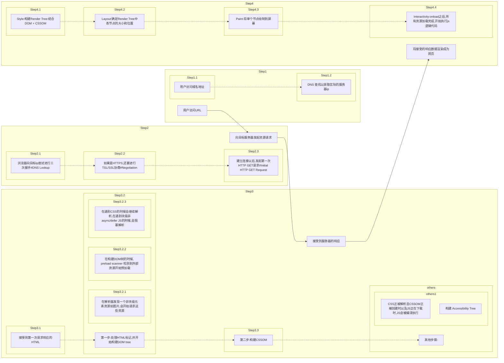

```mermaid
flowchart LR
subgraph Step1
A[用户访问URL]
    subgraph Step1.1
    a1[用户访问域名地址]
    end
    subgraph Step1.2
    a2[DNS 查找以获取实际的服务器ip]
    end
    a1 -..-> a2
end
subgraph Step2
B[向目标服务器发起资源请求]
	subgraph Step2.1
    b1[浏览器向目标ip尝试进行三次握手#DNS Lookup]
    end
    subgraph Step2.2
    b2[如果是HTTPS,还要进行TSL/SSL协商#Negotiation]
    end
    subgraph Step2.3
    b3[建立连接以后,发起第一次HTTP GET请求#Initial HTTP GET Request]
    end    
    b1 -..-> b2 -..-> b3

end
subgraph Step3
C[接受到服务器的响应]
	subgraph Step3.1
    c1[接受到第一次请求响应的HTML]
    end
	subgraph Step3.2
    c2[第一步:处理HTML标记,并开始构建DOM tree]
        subgraph Step3.2.1
        c2.1[在解析器发现一个非块级元素资源如图片,会开始请求这些资源]
        end    
        subgraph Step3.2.2
        c2.2[在构建DOM树的时候, preload scanner 检测到外部资源开始预加载]
        end
        subgraph Step3.2.3
        c2.3[在遇到CSS的时候会继续解析,在遇到块级非async/defer JS的时候,会阻塞解析]
        end           
    end
    subgraph Step3.3
    c3[第二步:构建CSSOM]
    end
    subgraph others
    c4[其他步骤:]
        subgraph others1
        c4.1[CSS正被解析且CSSOM正被创建时以及JS正在下载时,JS会被编译执行]
        end    
        subgraph others1
        c4.2[构建 Accessibility Tree]
        end 
    end
    c1 -..-> c2 -..-> c3 -..-> c4
 

	
end
subgraph Step4
D[将接受的响应数据渲染成为网页]
	subgraph Step4.1
    d1[Style:构建Render Tree:结合DOM + CSSOM]
    end
    subgraph Step4.2
    d2[Layout:确定Render Tree中各节点的大小和位置]
    end
    subgraph Step4.3
    d3[Paint:将单个节点绘制到屏幕]
    end    
    subgraph Step4.4
    d4[Interactivity:onload之后,所有资源加载完成,开始执行js逻辑代码]
    end    
    d1 -..-> d2 -..-> d3 -..-> d4
end

A --> B --> C --> D
```

