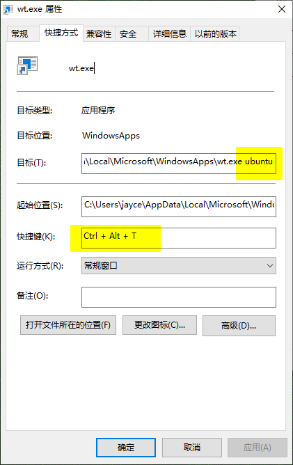

## 如何快速启动wsl

wsl 启动方式有多种，这里介绍几种方式：

1. <kbd>Win</kbd> + 直接继续按键搜索 "termin...." + 回车

2. <kbd>Win</kbd> + <kbd>r</kbd> + "wt" + 回车

3. 配置 `ctrl` + `alt` + `t` 启动：

   习惯 linux 的操作习惯可能更喜欢这种方式。 这里不借助其他工具的情况下如下实现：

   1. 复制下面内容，到资源管理打开：

      ```bash
      %USERPROFILE%\AppData\Local\Microsoft\WindowsApps
      ```

      在该目录下，能够看到一个名为 "wt.exe" 的启动程序

   2. 右键该程序，发送到 - 桌面快捷方式

   3. 回到桌面， 右键- 属性 刚才发送的快捷方式，并如下配置：

      

   4. 试试  `ctrl` + `alt` + `t`  快捷键吧

      

   5. 这种方式有一点需要注意，就是桌面的那个快捷方式不要删除，也不要移动到别的路径。 不过你可以右键它-属性 - 常规 - 勾选下方的 "隐藏" 属性。 

      

      

      

      

   

   

   

   