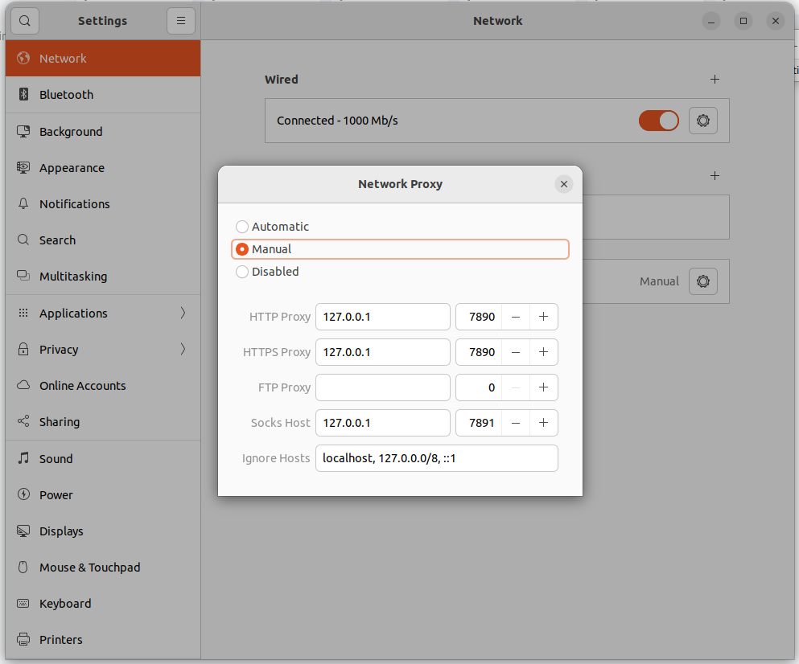

### 1. 下载解压

下载最新的 clash 包, 以 v1.12.0 / amd64 为例子, 在你准备放置的目录内:

```bash
wget https://github.com/Dreamacro/clash/releases/download/v1.12.0/clash-linux-amd64-v1.12.0.gz
```

解压

```bash
#解压
$ gunzip ./clash-linux-amd64-v*
#重命名
$ mv clash-linux-amd64-v1.12.0 clash 
#授予执行权限
$ chmod +x ./clash
```


### 2. 下载Country.mmdb 地理数据库文件

在同目录下,下载 Country.mmdb ip 数据库文件, 这个文件网上有很多, 随便找个用的人多的就行:

```bash
$ wget https://github.com/Dreamacro/maxmind-geoip/releases/download/20221212/Country.mmdb
```


### 3. 配置你的订阅

```bash
$ wget -O config.yaml subscription.example.com(你自己的订阅地址)
```

现在的基本目录如下:

```bash
jayce@jayce:clash$ tree
.
├── cache.db
├── clash
├── config.yaml
└── Country.mmdb

0 directories, 4 files
```


### 启动 Clash

```bash
$ ./clash -d .
```

命令正常启动输出:

```bash
jayce@jayce:clash$ ./clash -d .
INFO[0000] Start initial compatible provider CroLAX     
INFO[0000] HTTP proxy listening at: 127.0.0.1:7890      
INFO[0000] SOCKS proxy listening at: 127.0.0.1:7891     
INFO[0000] RESTful API listening at: 127.0.0.1:9090
......
```


### 配置 Ubuntu 的代理设置:

设置为手动,参数和上一步的输出参数保持一致




### 测试是否正常工作

可以在这个地址检测一下IP 是否变化了, https://whatismyipaddress.com/, 以及某G站点能否访问.


### 访问 管理平台 Web Dashboard

管理平台的地址是 : https://clash.razord.top/

默认没有设定这个管理平台访问密码, 如果需要密码, 可以在 config.yaml 文件中的 `secret` 字段配置密码. 

> 笔者在配置密码后 Chrome 出现跨域报错进不去, 使用 Firefox 正常.


### 简化工作流

现在这样用还是有点麻烦, 我们可以通过 Setting-Network-Network Proxy 中的手动/自动代理切换是否要开启代理.  

但是我们需要保证 `./clash -d .` 这个 terminal 进程不可关闭.


所以可以配置 clash 作为后台守护进程, 开机执行或者后台执行. 然后只需要切换 Setting-Network-Network Proxy 手动/自动代理 就可以 开/关 代理了. 

 其实也可以保持始终为 Setting-Network-Network Proxy 为 "手动" 代理. 将 clash 设定为开机启动进程,  然后在 dashboard-设置-代理模式 中开启  "规则" (默认配置), 这样访问外网 IP 就会走代理, 访问国内/局域网就不会走代理了.


**让 Systemd 接管 clash**

1. 创建 service 文件

   ```bash
   #创建service文件
   $ sudo touch /etc/systemd/system/clash.service
   #编辑service文件 
   $sudo vim /etc/systemd/system/clash.service 
   #编辑如下文本： 
   [Unit] 
   Description=clash daemon  
   [Service] 
   Type=simple 
   User=root 
   ExecStart=/YOUR/PATH/FOR/CLASH/clash -d /YOUR/PATH/FOR/CLASH/
   Restart=on-failure  
   [Install] 
   WantedBy=multi-user.target
   ```

   > ```diff
   > ...
   > #编辑如下文本： 
   > ...
   > User=root 
   > + ExecStart=/YOUR/PATH/FOR/CLASH/clash -d /YOUR/PATH/FOR/CLASH/
   > Restart=on-failure  
   > ...
   > ```
   >
   > 注意这里, `/YOUR/PATH/FOR/CLASH/` 就是你的 clash 执行文件路径, `-d` 后面是 `config.yaml` 文件所在位置. 
   >
   > 在保存之前, 最好先单独执行一下 
   >
   > ```bash
   > $ /YOUR/PATH/FOR/CLASH/clash -d /YOUR/PATH/FOR/CLASH/
   > ```
   >
   > 检查看看能不能正常执行.

   

2. systemd 接管

   ```bash
   $ sudo systemctl daemon-reload #进程重载
   $ sudo systemctl start clash #启动 clash
   $ sudo systemctl status clash #查看 clash 进程状态
   $ sudo systemctl restart clash #重启 clash
   $ sudo systemctl stop clashj #终止 clash 进程
   ```

   如果需要开机启动

   ```bash
   $ sudo systemctl enable clash #启用开机启动
   $ sudo systemctl disable clash #关闭开机启动
   $ sudo systemctl is-enable clash #检查是否开机启动
   ```

   


