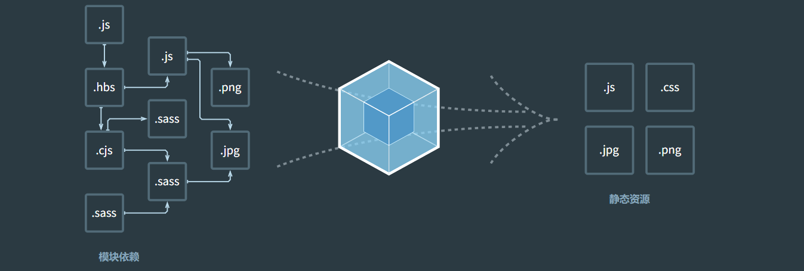

1.1.0 为什么需要webpack

> 副标题： webpack 解决了什么问题？

官网的明确定义： webpack 是现代 JS 应用程序的一个静态模块打包器。 当webpack 处理你的程序时，会为项目中的所有模块创建一个依赖图，然后打包成一个或者多个包。

从前端工程化的发展来阐述以往的工程化方式存在哪些问题：

1. 直接将外部的三方库，和自定义的模块代码，通过一些方式合并为一个文件。 