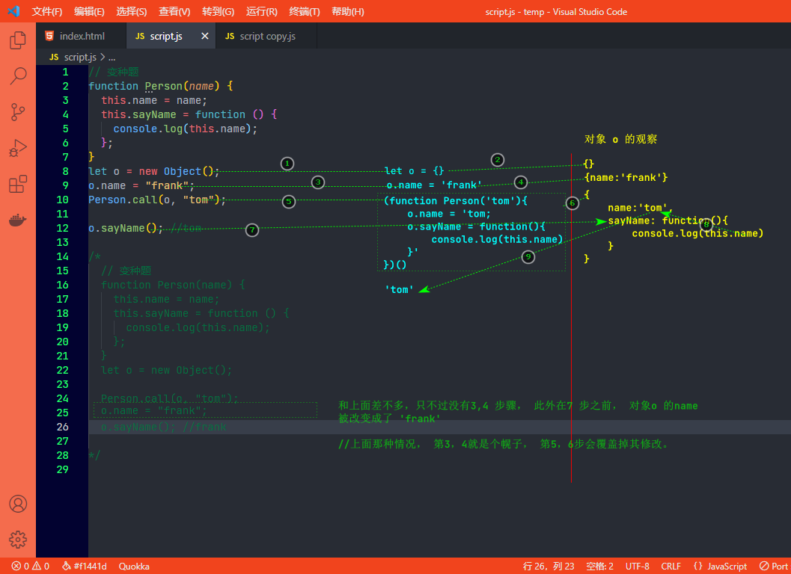

[TOC]

## 1. 理解对象

### 1.1 属性的类型

​		ESMA-262 使用一些内部特性来描述属性的特征。 这些特性是由为JavaScript实现引擎的规范定义的， 因此， **开发者不能再JavaScript 中直接访问这些特性**。

​		为了将某个特性标识为内部特性，规范会用两个中括号把特性的名称括起来， 比如 `[[Enumerable]]` 。

ECMAScript 中将属性分为了两种：

1. **数据属性**
2. **访问器属性**

#### 1.1.1 数据属性 `CEWV`

数据属性包含了一个保存数据值的位置。 值会从这个位置读取，也会写入到这个位置。 数据属性有四个特性描述它们的行为。

1. `[[Configurable]]` : 
   1. 属性是否可以通过 `delete` 删除并重新定义；
   2. 是否可以修改它的特性；
   3. 是否可以把它改为 访问器属性 
   4. 默认值为 `true`
2. `[[Enumerable]]` :
   1. 属性是否可以通过`for-in` 循环返回。
   2. 默认值为 `true`
3. `[[Writable]]` :
   1. 属性的值是否可以被修改；
   2. 默认值为 `true`
4. `[[Value]]` :
   1. 属性实际的值
   2. 默认值为 `undefined`

当我们创建一个对象时，如：

```javascript
let person = {
    name: "Nicholas"
};
```

属性`name` 的数据属性 `[[Configurable]]`、`[[Enumerable]]`、`[[Writable]]` 都会被设置为 `true`， 而` [[Value]]` 特性会被设置为指定的值，即 `"Nicholas"`。 

##### 1.1.1.2 修改与访问 数据属性

###### 1.1.1.2.1 修改属性的默认特性

`Object` 有两个静态方法用于修改 数据属性：

1. `Object.defineProperty()`
2. `Object.defineProperties()` 

**`Object.defineProperty()`**

该方法用于修改对象单个值的数据属性，其语法格式如下：

```javascript
Object.defineProperty(属性的对象，属性的名称，描述符对象（{CEWV}）)
```

示例：

```javascript
let person = {};
Object.defineProperty(person, "name", {
    Writable: false,
    value: "Nicholas"
});

console.log(person.name);	//	"Nicholas"
person.name = "Greg";
console.log(person.name); //	"Nicholas"
```

> :warning: 严格模式下，尝试修改只读属性的值会抛出错误。

```javascript
let person = {};
Object.defineProperty(person, "name", {
    configurable: false,
    value: "Nicholas"
});
console.log(person.name); // "Nicholas"
delete person.name;
console.log(person.name); // "Nicholas"
```

> :warning: 尝试删除`[[Configurable]]` 为`false` 的值在严格模式下会抛出错误

<span style="color:red">一旦某个属性被设定了 `[[Configurable]]` 值为`false` 以后， 该值将会被定义为不可配置， 也不能在变回可配置了。 也就是说，此时，如果再次调用`Object.defineProperty()` 并修改任何非 writable 属性还会导致错误。也无法被改变了。 </span>


**:warning:此外，在调用`Object.defineProperty()` 时， 如果不指定`configurable`, `enumerable` 和 `writable` 值，则全部默认为 `false` 。**

```javascript
let obj = {  };
Object.defineProperty(obj, "name",{value:'jayce'});
let a = Object.getOwnPropertyDescriptors(obj)

console.log(a);//{ name: { value: 'jayce',writable: false,enumerable: false,configurable: false } }
```

<span style="color:red">**注意： 如果已经有初始化值，则初始化时，数据属性已经被设定了默认值，都为true**</span>

```javascript
// 注意： 如果已经有初始化值，则初始化时，数据属性已经被设定了默认值，都为true
let obj = { name:'frank' };
Object.defineProperty(obj, "name",{value:'jayce'});
let a = Object.getOwnPropertyDescriptors(obj)

console.log(a);// { name: { value: 'jayce',writable: true,enumerable: true,configurable: true } }
```


**`Object.defineProperties()`**

`Object.defineProperties()` 用于批量修改默认数据属性，其语法格式如下：

```javascript
Object.defineProperties(obj,props)
```

示例：

```javascript
var obj = {};
Object.defineProperties(obj, {
  'property1': {
    value: true,
    writable: true
  },
  'property2': {
    value: 'Hello',
    writable: false
  }
  // etc. etc.
});
```


###### 1.1.1.2.2 访问数据属性

`Object` 提供了两个数据属性的访问方法，分别是：

1. `Object.getOwnPropertyDescriptor()`
2. `Object.getOwnPropertyDescriptors()`

`Object.getOwnPropertyDescriptor()` 用于获取单个对象值数据属性, 而`Object.getOwnPropertyDescriptors()` 则用于获取对象中所有值的数据属性。 

示例：

```javascript
let obj = { name:'frank',age:18,height:'175cm' };
Object.defineProperty(obj, "name",{value:'jayce'});
let res1 = Object.getOwnPropertyDescriptor(obj,'name')
let res2 = Object.getOwnPropertyDescriptors(obj)

console.log(res1);
/* 
{ value: 'jayce',
  writable: true,
  enumerable: true,
  configurable: true }
*/
console.log(res2);

/* { name: 
   { value: 'jayce',
     writable: true,
     enumerable: true,
     configurable: true },
  age: 
   { value: 18,
     writable: true,
     enumerable: true,
     configurable: true },
  height: 
   { value: '175cm',
     writable: true,
     enumerable: true,
     configurable: true } }
 */
```


#### 1.1.2 访问器属性

**访问器属性不包含数据值。**

访问器属性有4个特性描述它们的行为：

- `[[Configurable]]` : 表示属性是否可以通过 `delete` 删除并重新定义， 是否可以修改它的特性， 以及是否可以把它改为数据属性。 默认值为`true`
- `[[Enumerable]]` : 表示属性是否可以通过 `fot-in` 循环返回。 默认值为` true`
- `[[Get]]` ：获取函数， 在读取属性时调用。 默认值为 `undefined`
- `[[Set]]` : 设置函数， 在写入属性时调用。默认值为 `undefined`

访问器属性是不能直接定义的， 必须使用`Object.defineProperty()`。 

```javascript
// 定义一个对象， 包含伪私有成员 year_ 和公共成员 edition

let book = {
    year_: 2017,
    edition: 1
};

Object.defineProperty(book,"year",{
    get(){
        return this.year_;
    },
    set(newValue){
        if(newValue > 2017) {
            this.year_ = newValue;
            this.edition += newValue - 2017;
        }
    }
});

book.year = 2018;
console.log(book.edition); // 2
```

​		这个例子中 对象 book 有两个默认属性 : `year_` 和 `edition` 。 `year_` 中的下划线常用来表示该属性并不希望在对象方法的外部被访问。 另一个属性 `year` 被定义为一个访问器属性， 其中获取函数简单地返回`year_` 的值， 而设置函数会做一些计算以决定正确的版本（edition)。 因此，把`year` 属性修改为 2018 会导致 `year_` 变成 2018， edition 变成2。 **这是访问器属性的典型使用场景， 即设置一个属性值会导致一些其他变化发生**。

​		获取函数 和 设置函数 不一定都要定义。只定义获取函数 —— 属性只读。只定义设置函数——不可读取


#### 1.1.3 合并对象 —— `Object.assign()`

ES6 提供了` Object.assign()` 方法用于对象合并， 这个方法接收一个目标对象，和一个或者多个源对象作为参数， 然后对每个源对象执行**浅复制**， 如果多个源对象有相同的属性， 则使用最后一个复制的值。用例：

```javascript
let dest = { id: 'dest' };
let result = Object.assign(dest,{ id: 'src1', a:'foo'}, { id :'src2',b:'bar'});
console.log(result);//{id: 'src2', a: 'foo', b: 'bar'}
```

> 注意：实际的逻辑实现是，将每个源对象中可枚举（`Object.propertyIsEnumerable()` 返回 `true`） 和 自有(`Object.hasOwnProperty()` 返回 `true` ) 的属性复制到目标对象。 以字符串和符号为键的属性会被复制。 对每个符合条件的属性，这个方法会使用源对象上的 [[Get]] 取得属性的值，然后使用目标对象上的 [[Set]] 设置属性的值。 


#### 1.1.4 对象标识与相等判定 —— `Object.is()`

ES6 之前，`===` 对有一些结果的判定在不同的js引擎中表现不一样， ES6 中， 规范新增了一个统一方法， 考虑了一些边界情形，输出正常判定：

如:

```javascript
console.log(+0 === -0);// true
console.log(+0 === 0);// true
console.log(-0 === 0);// true
```

```javascript
console.log(Object.is(+0,-0));// false
console.log(Object.is(+0,0));// true
console.log(Object.is(0,0));// false
```

#### 1.1.5 增强的对象语法

 1. **属性值简写**

    给对象添加变量是，属性名和以变量作为属性值的变量名如果是一样的，可以直接简写：

    ```javascript
    let name = 'Matt';
    let person = {
        name: name
    }
    // 可以简写为：
    let name = 'Matt';
    let person = {
        name
    };
    ```

    

 2. **可计算属性**

    ES6 之前，对象的key 只能是字符串形式，现在可以使用变量，动态的访问和设定

    ```javascript
    const nameKey = 'name';
    const ageKey = 'age';
    const jobKey = 'job';
    let person = {
        [nameKey]:'Matt';
        [ageKey]:27;
    	[jobKey]:'Software Engineer'
    }
    ```

    > :notebook: 该特性很强大， 对象中，中括号所包围的对象属性键告诉运行时将其作为JavaScript 表达式而不是字符串来求值， 而因为被当作JavaScript 表达式求值，所以可计算属性本身可以是复杂的表达式，在实例化的时候再进行求值：
    >
    > *<span style="color:red">应用场景如给key拼接token:</span>*
    >
    > ```javascript
    > const nameKey = 'name';
    > const ageKey = 'age';
    > const jobKey = 'job';
    > let uniqueToken = 0;
    > 
    > function getUniqueKey(key){
    >     return `${key}_${uniqueToken++}`;
    > }
    > let person = {
    >     [getUniqueKey(nameKey)]: 'Matt',
    >     [getUniqueKey(ageKey)]:27,
    >     [getUniqueKey(jobKey)]: 'Software Engineer'
    > }
    > console.log(person);//{name_0: 'Matt', age_1: 27, job_2: 'Software Engineer'}
    > ```

 3. **简写方法名**

    ```javascript
    let person =  {
        sayName: function(name){
            console.log(`My name is ${name}`)
        }
    }
    person.sayName('Matt');// My name is Matt
    ```

    简写为：

    ```javascript
    let person = {
        sayName(name){
            console.log(`My name is ${name}`);
        }
    };
    person.sayName('Matt');// My name is Matt
    ```

    > <span style="background-color:#ff000055"> :question: 简写方法名同样使用获取函数和设置函数</span>
    >
    > ```javascript
    > let person = {
    >     name_: '',
    >     get name(){
    >         return this.name_;
    >     },
    >     set name(name){
    >         this.name_ = name;
    >     },
    >     sayName() {
    >         console.log(`My name is ${this.name_}`);
    >     }
    > }
    > person.name = 'Matt';
    > person.sayName(); //My name is Matt
    > ```
    >
    > <span style="background-color:#ff000055">简写方法名可以与计算属性键相互兼容：</span>
    >
    > ```javascript
    > const methodKey = 'sayName';
    > let person = {
    >     [methodKey](name){
    >         console.log(`My name is ${name}`);
    >     }
    > }
    > person.sayName('Matt'); // My name is Matt
    > ```

#### 1.1.6 对象解构

##### 1. 解构基本认识

```javascript
// 不使用解构
let person = {
    name: 'Matt',
    age: 27
};

let personName = person.name;
let personAge = person.age;
console.log(personName);//Matt
console.log(personAge);//27

// 使用对象解构
let person = {
    name: 'Matt',
    age: 27
};

let { name: personName, age: personAge } = person;
console.log(personName);//Matt
console.log(personAge);//27
```


> 解构可以使得在一个类似对象字面量的结构中，声明多个变量，同事执行多个赋值操作。 如果想让变量直接使用属性的名称， 那么可以使用简写语法，如：
>
> ```javascript
> let person = {
>     name: 'Matt',
>     age: 27
> };
> 
> let { name, job } = person;
> console.log(personName);//Matt
> console.log(personAge);//27
> ```

**在解构的同时定义默认值**

> 适用于引用的属性不存在于源对象中的情况

```javascript
let person = {
    name: 'Matt',
    age: 27
}
let { name, job='Software engineer' } = person;
console.log(personName);//Matt
console.log(personAge);//27
```

**注意要点**

> 1. <u>`null` 和 `undefind`为什么不能被解构 ？</u>
>
>    解构在内部使用 函数 `ToObject()` （不能在运行时环境中直接访问） 把源数据解构<u>转换为对象</u> 。这也就意味着，在对象解构的上下文中， <u>原始值会被当成对象</u>， `null` 和 `undefined` 无法被转换为对象。
>
>    ```javascript
>    let { _ } = null // _只是一个合法的变量名，这里可是是任意的，下同
>    let { _ } = undefined
>    // VM1010:1 Uncaught TypeError: Cannot destructure property '_' of 'undefined' as it is undefined.
>    ```
>
>    此外一些基本类型在被解构时也会发生一些意料之外的结果
>
>    ```javascript
>    let { length } = 'hello';
>    console.log(length);// 5
>    
>    let { constructor:c } = 4;
>    console.log(c === Number); // true
>    ```
>
> 2. 解构并不要求必须在解构表达式中声明。 不过，如果是给实现声明的变量赋值，则赋值表达式必须包含在一对括号中：
>
>    ```javascript
>    let personName, personAge;
>    let person = {
>        name: 'Matt';
>        age: 27
>    };
>    ({name: personName, age: personAge} = person);
>    console.log(personName.personAge);// Matt, 27
>    ```


##### 2. 嵌套解构

解构对于引用嵌套的属性或赋值目标没有限制。为此，可以通过解构来复制对象属性:

```javascript
let person = {
    name:'Matt',
    age:27,
    job: {
        title: 'software engineer'
    }
};
let personCopy = {};
({
    name: personCopy.name,
    age:personCopy.age,
    job:personCopy.job
} = person);

// 注意:
// 因为一个对象的引用被赋值给personCopy, 所以修改 person.job 对象的属性也会影响personCopy

person.job.title = 'Hacker'

console.log(person);//{"name": "Matt","age": 27,"job": {"title": "Hacker"}}
console.log(personCopy);//{"name": "Matt","age": 27,"job": {"title": "Hacker"}}
```

解构赋值可以使用嵌套解构，以匹配嵌套的属性：

```javascript
let person = {
    name: 'Matt',
    age:27,
    job: {
        title: 'Software engineer'
    }
};

let { job: {title } } = person;
console.log(title); // Software engineer
```

##### 3. 部分解构

需要注意， 涉及多个属性的解构赋值是一个输出无关的顺序话操作。 如果一个解构表达式涉及多个赋值，开始的赋值成功而后面的赋值出错，则整个解构赋值只会完成一部分（错误会被捕获的情况下，否则会错误中断）。

```javascript
let person = {  
  name: 'Matt', 
  age: 27 
}; 
 
let personName, personBar, personAge; 
 
try { 
  // person.foo 是 undefined，因此会抛出错误 
  ({name: personName, foo: { bar: personBar }, age: personAge} = person); 
} catch(e) {} 
 
console.log(personName, personBar, personAge); 
// Matt, undefined, undefined 
```

##### 4. 参数上下文匹配（对函数参数进行解构）

```javascript
let person = {
    name: 'Matt',
    age: 27
};
function printPerson(foo,{name,age},bar){
    console.log(arguments);
    console.log(name,age);
}
function printPerson2(foo,{name:personName,age:personAge},bar){
    console.log(arguments);
    console.log(personName,personAge);
}
printPerson('1st',person,'2nd');
printPerson2('1st',person,'2nd')
//{
    "0": "1st",
    "1": {
        "name": "Matt",
        "age": 27
    },
    "2": "2nd"
}
```


## 2. 创建对象

##### 1. 什么情况下需要面向对象的概念，传统的对象存在什么问题 ？

在提及面向对象的概念之前，JavaScript 中创建一个对象通常有两种方式去创建一个对象，分别是通过字面量和通过`new Object()` 的方式去创建。 

这样有一个很大的问题 —— <span style="color:#00ff0088">**创建具有同样接口的多个对象需要重复编写很多代码**</span>

传统模式也有办法解决这类问题， 那就是利用工厂模式

> 工厂模式即： 用于抽象创建特定对象的过程，也就是通过函数调用，去创建对象。

```javascript
// 示例
function createPerson(name,age,job){
    let o = new Object();
    o.name = name;
    o.age = age;
    o.job = job;
    o.sayName = function(){
        console.log(this.name);
    }
    return o;
}
let person1 = createPerson("Nicholas",29."Software Engineer");
let person2 = createPerson("Grep",27,"Doctor");
```

> 函数 createPerson()接收三个参数， 根据这几个参数构建了一个包含Person 信息的对象。 可以根据不同的参数多次调用这个函数， 这种工厂模式虽然可以解决创建类似对象的问题，但是**没有解决对象标识问题** （**即新创建的对象是什么类型**）。

##### 2. 构造函数模式

###### 2.1 定义构造函数

ES5.1 引入了构造函数和原型继承的特性， 使得我们可以利用构造函数解决上述 **对象标识的问题**。

```javascript
function Person(name,age,job){
    this.name = name;
    this.age = age;
    this.job = job;
    this.sayName = function(){
        console.log(this.name);
    }
}
let person1 = new Person("Nicholas",29."Software Engineer");
let person2 = new Person("Greg",27."Doctor");
person1.sayName(); //  Nicholas
person2.sayName(); //  Greg
```

> 这个例子中 `Person()` 构造函数代替了 `createPerson()` 工厂函数， 实际上，`Person()` 内部的代码跟 `createPerson()` 基本是一样的， 只是有如下区别：
>
> 1. 没有显示地创建对象
> 2. 属性和方法直接赋值给了`this`
> 3. 没有`return`

> 且注意，为了区分普通函数，构造函数`Person` 的首字母大写了， 但是*小写在语法层面是合法的*。

###### 2.2 实例化对象

上例中，通过`new` 操作符去 调用 构造函数，以创建一个`Person` 实例， 实际上会执行以下操作:

1. 在内存中创建一个新对象
2. 这个新对象内部的 `[[Prototype]]` 特性被赋值为 构造函数的 `prototype` 属性 （`prototype` 也叫做<span style="color:red">原型对象</span>）
3. 构造函数内部的`this` 被赋值为这个新对象(即`this` 指向新对象)
4. 执行构造函数内部的代码（给新对象添加属性）
5. 如果构造函数返回 非空对象，则返回该对象；否则， 返回刚创建的新对象。 


###### 2.3 构造函数模式的一些深入

通过构造函数所实例化的对象中，都有一个 `constructor` 属性指向 Person, 如下所示：

```javascript
function Person(name, age) {
  this.name = name;
  this.age = age;
}
let person1 = new Person("jay", 28);
console.dir(Person);
console.dir(person1);
```


> 此时，如果验证：
>
> ```javascript
> console.log(Person === person1.constructor);
> ```
>
> 将会输出`true` 。
>
> > 可能你看到了 实例化的对象中, `constructor` 属性在`[[Prototype]]` 下，这是因为它是内部特性。注意： 前面说过，规范会用两个中括号把内部特性的名称括起来，且**开发者不能在JavaScript 中直接访问这些特性**
>
> 实际上`__proto__` 也是指向构造函数的，如果这样验证：
>
> ```javascript
> console.log(Person === person1.__proto__.constructor);
> ```
>
> 也将输出`true` ， `__proto__` 被称之为 <span style="color:red">对象原型</span>,
>
> > **即， 实例对象的`__proto__` 对象原型，指向了构造函数的 `prototype` 原型对象 。**

`constructor` 本来是用于**标识对象类型**的。 不过，一般认为`instanceof` 操作符是确定对象类型更可靠的方式。  上例中的实例化对象`person1` 即是 `Person` 的实例，也是 `Object` 的实例：

```javascript
console.log(person1 instanceof Person);// true
console.log(person1 instanceof Object);// true
```

> 这里不需要太纠结， 尽管`person1 instanceof Person` 返回 `true` ==>  实例化对象是一个构造函数的实例 ？  这就是Js 的特点，只是语法糖而已，万物皆对象。

这样，通过定义自定义构造函数，就可以确保实例被标识为特定类型。 这是相比于工厂模式的一个很大的好处。 

###### 2.4 构造函数也是函数

构造函数与普通函数的唯一区别就是调用方式不同。 除此之外， 构造函数也是函数。 并没有把某个函数定义为构造函数的特殊语法。 任何函数只要使用 `new` 操作符调用就是构造函数， 而不是用`new` 操作符调用的函数就是普通函数。 比如: 

```javascript
function Person(name,age){
    this.name = name;
    this.age = age;
    this.sayName = function(){
        console.log(this.name);
    }
}
// 作为构造函数
let person = new Person('jay',26);
person.sayName(); // jay

// 作为函数调用
Person('jay',26);
window.sayName();// jay
```

> 函数中的this 指向其调用者， 因此，作为函数调用时， 默认是指向global 的 ，在浏览器中，就是window.
>
> 利用这个特点，实际上可以实现:
>
> ```javascript
> // 在另一个对象的作用域中调用
> let o = new Object();
> Person.call(o,'tom',24)
> o.sayName();//tom 
> ```
>
> 变种问题：
> 


## 3. 继承


## 4. 类