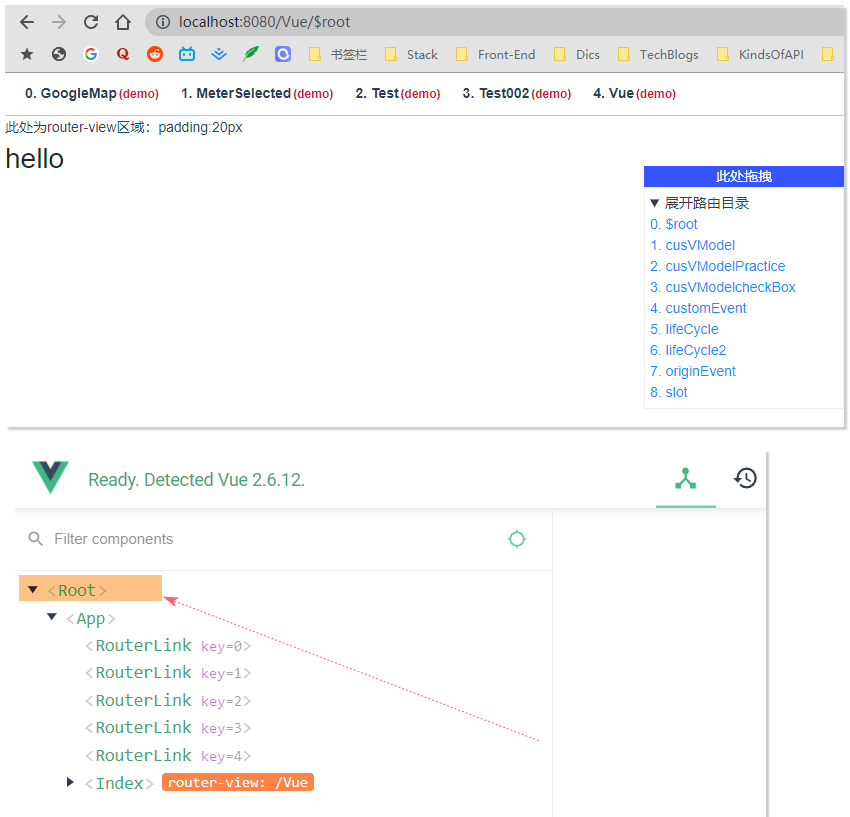
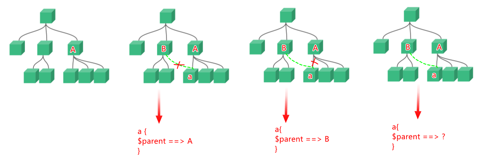
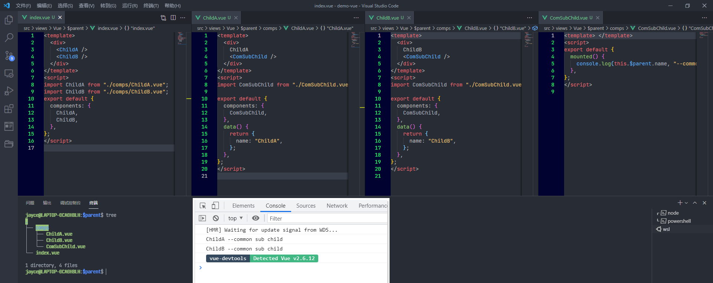

[toc]

## 1. `vm.$root`

### 1.1 描述

> 当前组件树的根 Vue 实例。如果当前实例没有父实例，此实例将会是其自己。

在Vue 中， 什么是一个组件树的根实例？ 实际上，通过Vue Devtools 能够很清楚的看到：


具体的，在代码中，Vue 项目的入口文件`main.js` 中，一般的会有这样的代码段：

```javascript
new Vue({
  router,
  store,
  render: (h) => h(App),
}).$mount("#app");
```

创建了一个Vue实例，并塞入了一些东西后，通过`$mount` 挂载到了`#app` 这个dom节点。 

实际上，和我们常用的组件化开发一样，我们也能在创建组件时（即便是根组件），也能够通过一个个工厂函数的形式，定义一些数据作为这个组件的动态属性值。 例如：

```javascript
new Vue({
  data() {
    return {
      name: "$root",
    };
  },
  router,
  store,
  render: (h) => h(App),
}).$mount("#app");
```

这样，你便能够在全局范围内，在组件树的任何一个节点，通过`vm.$root` 获取到这个根实例，也就能以`vm.$root.name` 的形式访问到我们定义的`name` 属性。 

### 1.2 能力

我们可以发现，这点很像一个中央数据管理对象， 类似localStorage，或者更加类似于store，或者Vuex。 没错，只是取决于项目的复杂度考虑，通常不会这样去使用。 但是如果项目本身比较小，而无需引入Vuex 的情况下。 我们可以考虑这样去实现需求。 

并且 ，由于`data` 对象中的所有的 property 都会被加入到 Vue 的**响应式系统**中， 这意味着，这个值的变化将会引起所有引用处的dom渲染更新。 即：

```javascript
<!--组件树中的任意组件a-->
vm.$root.name = "update name value!"
```

```javascript
<!--组件树中的任意组件b-->
<template>
	{{$root.name}}
</template>
```

只要在组件树中，任意组件a中去修改`name`值，其他任意引用的组件都会自动更新。


## 2. `$parent` 和`$children`

### 2.1 描述

`$parent` 指代父实例，如果当前实例有的话。

而`$children`指代子实例，如果当前实例有的话。

**所不同的是，<u>也值得注意的</u>是这二者的类型不同，`$children`  的类型是 `Array<Vue instance>` ， 而 `$parent` 的类型是 `Vue instance`** 

一个组件可以有多个子组件，因此 `$children`  的类型是 `Array<Vue instance>` ， 这是易于理解的，但是，为什么  `$parent` 的类型是 `Vue instance`  而不是   `Array<Vue instance>` 呢？

一个组件不是也可以被多个组件引用吗？ 那父组件不是也应该有多个吗？，如果我们画一个图来理解：



其实，这个原因，文档中早有提及：

> 注意当点击按钮时，每个组件都会各自独立维护它的 `count`。因为你每用一次组件，就会有一个它的新**实例**被创建。[link](https://cn.vuejs.org/v2/guide/components.html#%E7%BB%84%E4%BB%B6%E7%9A%84%E5%A4%8D%E7%94%A8)

以下是一个验证demo:



