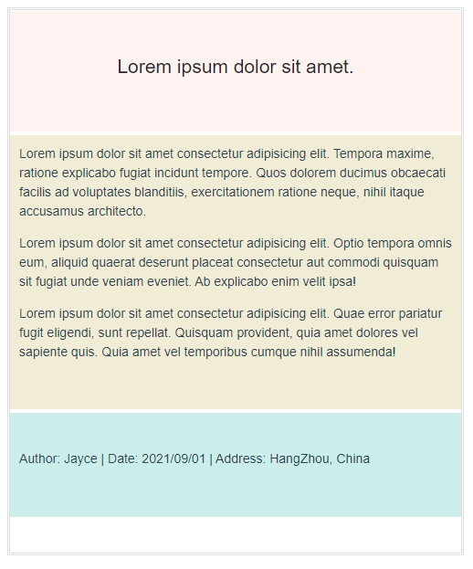
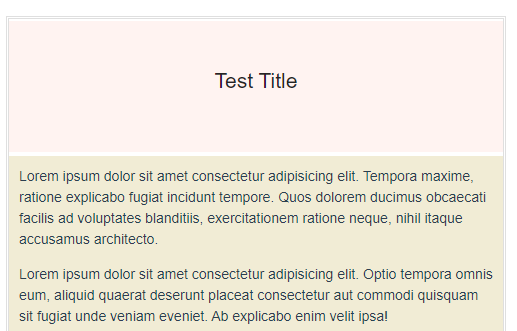
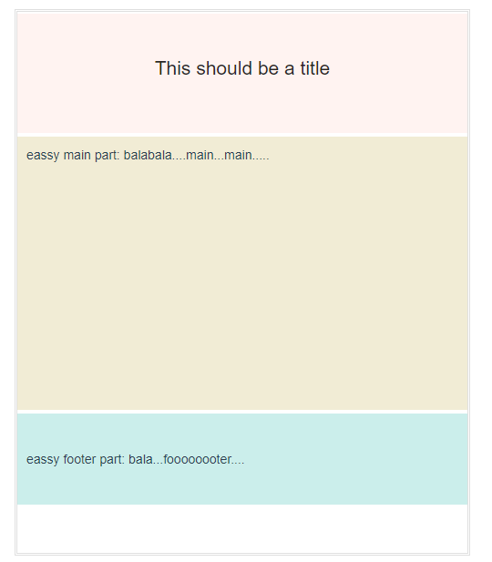
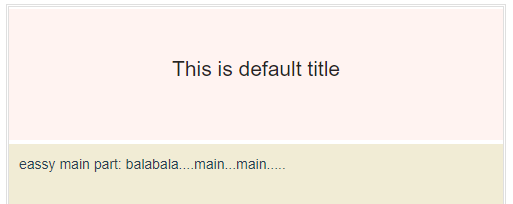
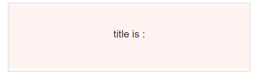
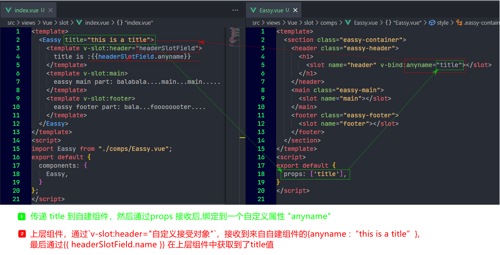

[toc]

## 插槽内容

假设我们有这样一个组件：

```javascript
<template>
  <section class="eassy-container">
    <header class="eassy-header">
	lorem
    </header>
    <main class="eassy-main">
    lorem
    </main>
    <footer class="eassy-footer">
	lorem
    </footer>
  </section>
</template>
```

它看起来的效果就像是这样：



我们创建了一个文章模板组件，现在，假如你要将这个模板作为公用组件，那么通常，我们可能需要先再这个组件内部，用假数据，写好所有的样式。 然后在父组件中引用时，传入变量，去渲染文章的标题，文章主题，文章末尾等。 

但是这样做，存在诸多问题，例如样式的兼容性，要让这个组件能够被通用是有难度的，主要是文章是需要排版的，如果你通过v-html 传入模板字符串，去拓展排版，插入多媒体去实现需求自然也是可行，不过这样一来，其实就失去了组件封装的初衷 ---- 简化，提高可维护性。 

所以这时候，Vue 就提供了一种解决方式，我只保留这个组件封装的基本意义，例如基本的布局，结构，基本的样式，就好了。 其他的**需要创造性，存在变动的地方，我全部都暴露给父级对应的接口。在本组件内，我只留下一个空位，以待内容插入。 实现高度自定义。**

首先，我们基本认识下，具体是什么意思？

例如，文章的标题，当然应该是个变量，以往，我们肯定会通过Props等方式向下传参。 刚才我们简单分析了弊端，所以我们这里不期望使用传统传参的方式去实现。 

我们仅需要在组件内需要被占位的地方，放置一个`<slot></slot>` 标签即可。即:

```javascript
<template>
  <section class="eassy-container">
    <header class="eassy-header">
      <h1>
        <slot></slot>
      </h1>
    </header>
    <main class="eassy-main">
      <p>Lorem ipsum dolor sit
      .......
```

然后在父组件，该组件标签的中间，写入内容，他就会被插入到这个`<slot></slot>` 所占位的地方。

```javascript
<template>
  <Eassy>Test Title</Eassy>
</template>
<script>
import Eassy from "./comps/Eassy.vue";
export default {
  components: {
    Eassy,
  },
  data() {
    return {
      user: {
        name: "jayce",
      },
    };
  },
};
</script>
```




## 具名插槽

刚才，我们演示了文章标题的插槽用法。 现在如果我们类似的实现文章主体和结尾。 我们当然就需要指定多个`<slot>`用以占位了，可以预见的是，在上层组件（父组件）中，我们同时要塞一些内容到自封装组件内部，肯定需要让组件知道，那些内容，插到哪里去。 所以，我们要在`<slot>`定义的地方指定一个`name` 属性， 在上层组件，插入的时候，也需要以某种方式显式的明确插入位置，具体的如下：

自封装组件中：给`<slot>` 增加一个`name` 属性（attribute）

```javascript
<template>
  <section class="eassy-container">
    <header class="eassy-header">
      <h1>
        <slot name="header"></slot>
      </h1>
    </header>
    <main class="eassy-main">
      <slot name="main"></slot>
    </main>
    <footer class="eassy-footer">
      <slot name="footer"></slot>
    </footer>
  </section>
</template>
```

上层组件中（父组件）：通过`v-slot:name`  指定给一个`<template>` 以指明将要插入的位置

```javascript
<template>
  <Eassy>
    <template v-slot:header>
      This should be a title
    </template>
    <template v-slot:main>
      eassy main part: balabala....main...main.....
    </template>
    <template v-slot:footer>
      eassy footer part: bala...foooooooter....
    </template>
  </Eassy>
</template>
```



> 你需要注意的是，上面我们在仅插入一个文章标题的时候，并没有指定`name` 属性，也没有通过`v-slot` 指定这个唯一的`<slot>`插槽，其实并不是没有，而是如果不加指定，其`name` 属性被隐式的指定为"default"

## 后备内容（默认slot内容）

如果你希望插槽处有一个默认内容，你仅需要在`<slot></slot>` 中间写默认值即可。让上层组件有后来的插值时，默认值将会被自动的覆盖掉。

就像这样:

```javascript
<!--自建组件内-->
<template>
  <section class="eassy-container">
    <header class="eassy-header">
      <h1>
        <slot name="header">This is default title</slot>
      </h1>
    </header>
```

```javascript
<!--上层组件不指定该插值或者插入空值即可-->
<template>
  <Eassy>
    <!-- <template v-slot:header>
      This should be a title
    </template> -->
    <template v-slot:main>
      eassy main part: balabala....main...main.....
    </template>
    <template v-slot:footer>
      eassy footer part: bala...foooooooter....
    </template>
  </Eassy>
</template>    
```




## 传入变量

在文档中，这部门内容，称为编译作用域。 

它的意思是， 自建组件的编译存在于一个作用域，该组件中的data中的属性，或者自上层组件传入的prop 都属于这个作用域。  而上层组件的编译则属于另一个作用域。  你可以正常的通过props 自上层组件向自建组件传递值， 但是，你不能直接在上层组件中直接取到自建组件作用域中的值。换句话说，有时候你需要在上层组件（父组件）的插槽内容中引用来子自建组件（子组件），而这种行为默认是不被允许的。

文档是这样概括的：

> 父级模板里的所有内容都是在父级作用域中编译的；子模板里的所有内容都是在子作用域中编译的。

具体的演示，就像这样：

假如你向下传入了一个 ”[非 Prop 的 Attribute](https://cn.vuejs.org/v2/guide/components-props.html#非-Prop-的-Attribute)“  作为文章标题的默认值，也就是让默认值也变作可以外部传入：

```javascript
<!--上层组件-->
<template>
  <Eassy title="this is a title">
    <template v-slot:header>
      title is :{{title}}
    </template>
    <template v-slot:main>
	............
```

```javascript
<!--自建组件-->
<template>
  <section class="eassy-container">
    <header class="eassy-header">
      <h1>
        <slot>{{title}}</slot>
        <!-- <slot name="header">This is default title</slot> -->
      </h1>
    </header>
..........
<script>
export default {
  props: ['title']
..........
```



这时候，你不能直接在上层组件中去使用(获取到)这个 `title`


这时候你就需要用到作用域插槽：

## 作用域插槽



这个过程确实让人有些迷惑，从上层组件传下去的值，自己取不到，非要转一圈，再拿到。不知道有什么作用。 - - 

