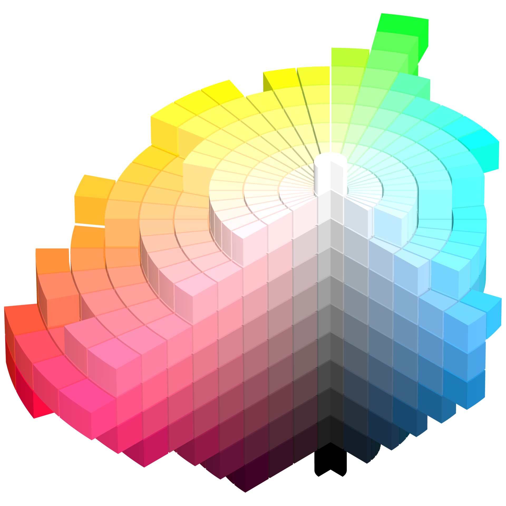

> 原文 https://css-tricks.com/nerds-guide-color-web/

## 计算机颜色表示（Color values）

### RGB Values

通过一个范围值（0-255）去别表示，红，绿，蓝 的占比，

```bash
rgb(x,x,x); # x: 0-255
```

加一个不透明度维度，作为最后一个值，就是RGBA

```bash
rgba(x,x,x,y); # y: 0-1
```


## Hex Values (十六进制值) 

实际和RGB 颜色值类似，不同的是，将表示范围用十六进制数表示。它由8个bit位构成，即一个字节。

最小值为：`#00000000` ,最大值为`#ffffffff`,  从前往后，两两bit为一组，分别表示了Red, Green, Blue, Opacity 。

可以不表示不透明度，只写六个Bit 位， 这时默认的不透明度为FF，即完全不透明。 

此时，如果两两Bit的值，都是重复的，如，`#ff4400` , 那么就可以简写为`#f40`。


## HSL Values

Hsl 颜色表示，是通过描述，Hue , Saturaion ,  以及 Lightness 三个维度来表示颜色， 即色调， 饱和度， 亮度。

Hue 的取值为 0 ~ 360， 表示在其专门的坐标系上的角度所在的色调 , 而 饱和度和亮度，都是通过百分比值表示，取值范围是 0 ~ 100% 。 以下是其参考图。 



此外，如果加上一个 不透明度， 就是hsla 值。 

```bash
hsl(x,y,y)		# x: 0-360, y: 0-100
hsla(x,y,y,z)	# x: 0-360, y: 0-100, z:0-1
```


## 命名色（Named Colors）

有很多常用的颜色，能被直接描述的颜色，被直接命名了， 例如， red, yellow,green,blue...


## 色彩变量（Color Variables）

原生css 支持变量

```css
:root {
  --brandColor: red;
}

body {
  background: var(--brandColor);
}
```


## currentColor

这个变量可以方便的用于继承颜色

```css
.div-external { color: orange; }
.div-internal { border: 1px solid currentColor; }
```

如果有一个嵌套的元素， 外层元素的color 被指定为橙色， 那么作为子元素， 如果使用了 currentColor ， 该值将会是橙色。 


## 阴影 （Box and Text Shadows）

试验台： https://www.cssmatic.com/box-shadow


## 渐变 （Gradients）

试验台 https://www.cssmatic.com/gradient-generator