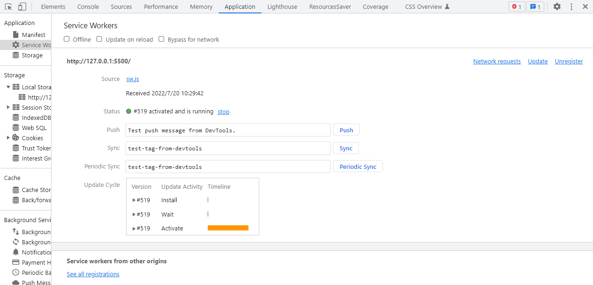
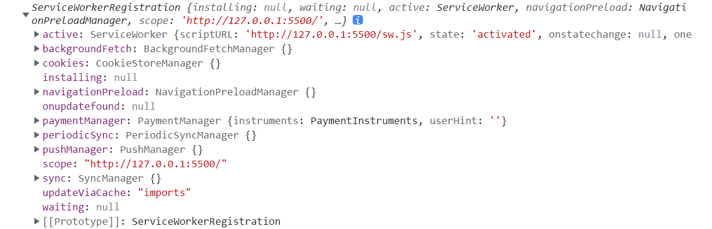
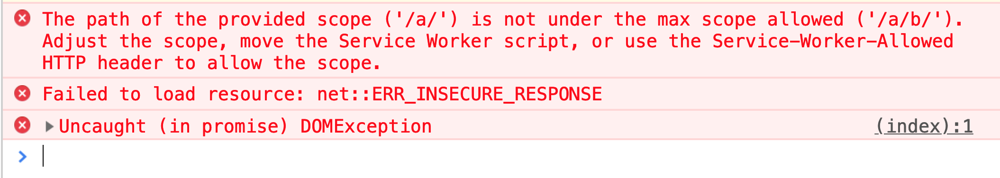
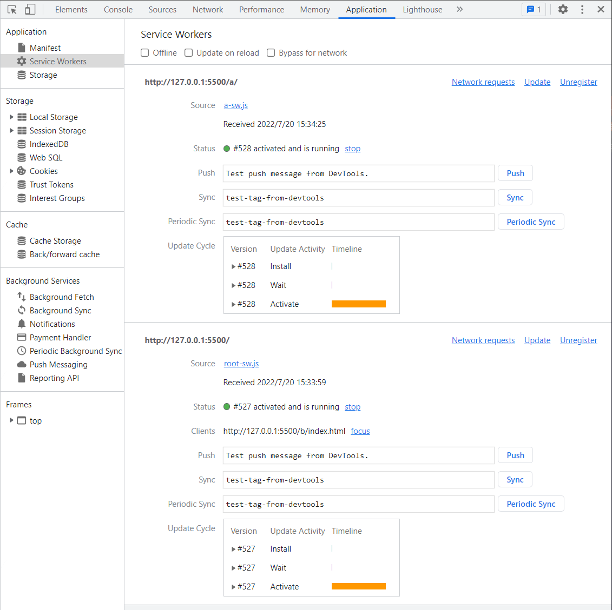
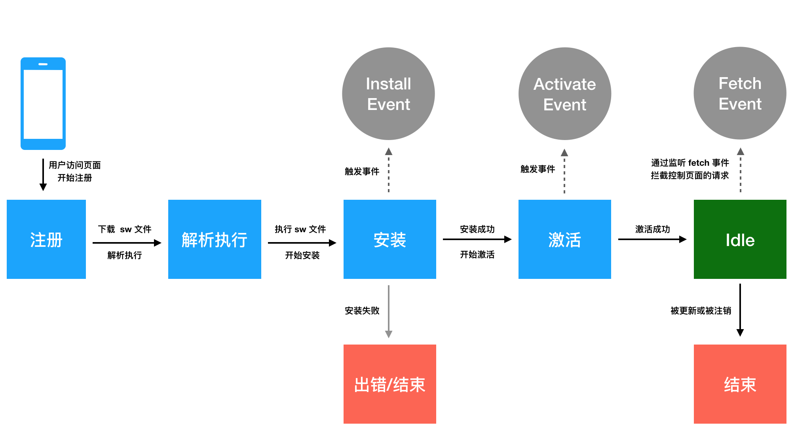

[toc]

## 1. Service Worker 简介

### **1.1  主线程 与 工作线程**

通常所讲的 Service Worker 指的是 Service Worker 线程。 浏览器中执行的 JavaScript 文件是运行在一个单一的线程上，称之为 **主线程**。 而 Service Worker 是一种独立于浏览器主线程的 **工作线程**， 它与当前浏览器主线程是完全隔离的，且<u>有着自己独立的执行上下文</u>。

### **1.2  PWA 重要技术**

Service Worker 能提供一种良好的统筹机制对资源缓存和网络请求进行缓存和处理，是PWA 实现离线访问，稳定访问，静态资源缓存的一项重要技术。 


### **1.3  通过demo快速认识下 Service Worker**

借由一个简单的demo 了解下什么是 Service Worker。

```bash
$ mkdir serviceWorkerDemo
$ touch serviceWorkerDemo/index.html serviceWorkerDemo/sw.js
$ tree
.
└── serviceWorkerDemo
    ├── index.html
    └── sw.js
```

**index.html**

```html
<!DOCTYPE html>
  <head>
    <title>Service Worker Demo</title>
  </head>
  <body>
    <script>
      navigator.serviceWorker.register('./sw.js')
    </script>
  </body>
</html>
```

H5 提供了一个 Service Worker API ， 能够进行 Service Worker 线程的注册、注销等工作，在该实例中，通过 `navigator.serviceWorker.register()`方法，就能够注册一个 Service Worker, 在当前的浏览器主线程的基础上新起一个 Service Worker 线程。

Service Worker 文件可以任意命名，这个的实例为 `sw.js`, 其内容就是在 Service Worker 线程 上下文（Context）中执行的内容（如果文件为空，那么worker 线程什么也不会做），由于 Service Worker 线程是独立于主线程的工作线程， 所以在  `sw.js` 中的任何操作都不会影响到主线程。 

> 利用 `lite-server` 、`local-web-server` 等web服务工具启动 页面， 或者使用 VS code 中的 `live-server` 插件，启动页面。在Chrome 浏览器中，可以 在 `Applications > Service Worker` 面板中看到当前 Service Worker 线程的状态。
>
> 

如果调节当前网络状态为 [离线]， Service Worker 依然能够正常工作，所以通过这个例子可以发现， Service Worker 不仅是一个独立于主线程的工作线程，并且还是一个可以在离线环境下运行的工作线程。这也正是 PWA 的离线与缓存功能实现的可行性基础。


### 1.4 为什么会出现 Service Worker ?

Service Worker 的来历可以从两个方面来介绍：

一方面，由于浏览器中 JavaScript 单线程执行的特性，随着 Web 技术更迭，业务也在不断的复杂化，在 JavaScript 中往往会出现很多耗资源，耗时间的复杂运算过程。所以 W3C 先是提出了 **Web Worker** API 来解放主线程， 开发者可以将耗时任务放在 Web Worker 中进行，工作完成后，通过 `postMessage` 告诉主线程结果，主线程则通过 `onMessage` 接收 Web Worker 的执行结果，从而释放主线程的性能压力。

但是， Web Worker 是临时存在的，每次做的事情的结果不能被持久存下来，下次访问 Web App 同样的复杂工作还需要被 Web Worker 重新处理一遍，这同样也是一件消耗资源的事情，只不过不在主线程消耗而已。 

那能不能有一个 Worker 线程是一直可以持久存在的，并且随时准备接收主线程的命令呢？ 基于这样的需求， W3C 推出了最初版本的 Service Worker， **Service Worker 在 Web Worker 的基础上加了持久离线缓存能力**，可以通过自身的 **生命周期** 特性保证复杂的工作只处理一次，并且持久缓存处理结果。


而另一方面，为了结果 Web 网络连接不稳定的问题， W3C 很早就推出了  ApplicationCache 机制来解决离线缓存的问题， 做法是在 HTML 页面中指定一个 清单文件 `manifest.appcache`, 清单中指定需要离线缓存的静态资源， ApplicationCache 能够解决离线可访问的问题。 

**一个示例：**

假设存在这么一个项目目录：

```bash
.
└── applicationCacheDemo/
    ├── index.html
    └── manifest.appcache
```

**index.html**

```html
<!DOCTYPE html>
<html manifest="./manifest.appcache">
</html>
```

**manifest.appcache**

```yaml
CACHE MANIFEST
# version xx.xx.xx
CACHE:
cached.png
cached.js

NETWORK:
noCached.html
noCached.css

FALLBACK:
/ 404.html
```

`CACHE` 字段配置了需要在当前页面离线缓存的静态资源，`NETWORK` 字段配置了当前页面不需要离线缓存的静态资源， `FALLBACK` 字段制定了一个后备页面，当资源无法访问时，浏览器会使用该页面。 该段落的每条记录都列出了两个 URI， 第一个表示资源，第二个表示后备页面。两个URI都必须使用相对路径并且与清单文件同源。 可以使用通配符。

虽然通过 ApplicationCache 机制能够解决 Web App 的离线缓存问题，但是同时也带来了不小的问题：

- 在 manifest.appcache 文件中定义的资源全部被成功加载后，这些资源文件连同引用 manifest.appcache 文件的 HTML 文档一并被移动到永久离线缓存中。 所以如果只想缓存 JS、CSS、Image 等文件，而不希望缓存 HTML 文档以保持最新内容的情况来说，是个非常大的问题。
- 根据 ApplicaionCache 的加载机制，<u>如果仅仅修改被缓存资源文件的内容（没有修改资源文件的路径或者名称），浏览器将直接从本地离线缓存中获取资源文件。</u> 所以每次修改资源文件的同时，需要修改manifest.appcache 文件，以触发资源文件的重新加载和缓存，维护成本太高。
- 靠一个 manifest.appcache 配置文件来维护一个复杂的站点的缓存策略实在是一件非常艰难的工作，毕竟单纯靠配置是非常不灵活的。 
- 对动态请求无法处理。

通过一段时间的实践后， W3C 决定废弃 ApplicationCache。


Service Worker 就很好的解决了 ApplicationCache 的痛点问题，它能够通过非常多的缓存策略来灵活的管理 Web App 的离线缓存，大大降低维护成本。
基于 Worker 的工作线程的离线能力，和离线缓存机制的双重迫切需求， W3C 最终提出的 Service Worker API 可以以独立工作线程的方式运行，结合持久缓存调度策略，能够很好的解决离线缓存问题，并且剋以非侵入的方式与现存的 Web App 结合使用，从而实现 PWA 渐进式的离线与缓存的效果。


### 1.5  Service Worker 的特点

Service Worker 功能虽然强大，但是使用 Service Worker 还是有一定的条件以及一些专用的特点的。

1. 必须运行在 HTTPS 协议下
   出于安全的考虑， Service Worker 必须运行在 HTTPS 协议下， Git pages 是一个用来测试 Service Worker 的好地方，因为它就支持 HTTPS， 直接就可以测试静态页面和静态资源，为了便于本地开发测试，`localhost`， `127.0.0.1` 这种非 HTTPS 协议也被浏览器认为是安全源。

2. 有自己完全独立的执行上下文

   Service Worker 线程有自己完全独立的执行上下文，一旦被安装成功就永远存在，除非线程被程序主动解除，而且 Service Worker 在访问页面的时候可以直接被激活，如果关闭浏览器或者浏览器的标签的时候， 会自动睡眠，以减少资源损耗。

3. 不能直接操作 DOM

   Service Worker 是完全异步实现的，内部的接口的异步化都是通过 Promise 实现，并且在 Service Worker 中不能直接操作 DOM， 出于安全和体验的考虑， UI 的渲染工作必须且只能在主线程中完成。

4. 可以拦截并代理请求，可以处理请求的返回内容

   Service Worker **可以拦截并代理请求，可以处理请求的返回内容**，可以持久化缓存静态资源达到离线访问的效果，和 ApplicationCache 不同， Service Worker 的所有离线内容<u>开发者完全可控</u>，甚至是可以控制动态请求，第三方静态资源等。

5. 消息推送，后台同步

   由于 Service Worker 可以离线并且在后台工作，所以可以进行 **推送消息**， **后台同步** 资源等功能。


## 2. Service Worker 注册

本节会介绍如何注册一个 Service Worker、在不同项目架构下注册 Service Worker 的方法、 Service Worker 注册的一些细节和注意点等。

### 2.1 作用域

Service Worker 是有自己的作用域的， Service Worker 的作用域是一个 URL path 地址， 指的是 Service Worker 能够控制的页面的范围， 例如： 某个 Service Worker 的作用域为 `https://somehost/a/b`， 那这个 Service Worker 能控制 `https://somehost/a/b` 目录下的所有页面，可以包含下面列出的页面：

- `https://somehost/a/b/index.html`
- `https://somehost/a/b/c/index.html`
- `https://somehost/a/b/another./html`
- ...

所谓 “控制页面” 指的是， S二vice Worker 可以处理这些页面里面的资源请求和网络请求，然后通过 Service Worker 自身的调度机制构建离线缓存策略。 如果页面不在 Service Worker 的作用域范围内， Service Worker 就无法处理页面的任何资源或请求。

为了加深对 Service Worker 作用域的理解，接下来还是来看下 serviceWorkerDemo 这个示例：

**index.html**

```html
<!DOCTYPE html>
  <head>
    <title>Service Worker Demo</title>
  </head>
  <body>
    <script>
      if ('serviceWorker' in navigator) {
        navigator.serviceWorker.register('./sw.js')
          .then(reg => {
            console.log(reg)
          })
      }
    </script>
  </body>
</html>
```

从上面的代码可以看出 `navigator.serviceWorker.register()` 方法返回的是一个 Promise ， 这个 Promise 中 resolve 返回的是 Service Worker 注册成功后返回的 ServiceWorkerRegistration 对象。 其打印结果如下：



ServiceWorkerRegistration 对象中的 scope 的值就是当前 Service Worker 的作用域，在这个示例中为 `http://127.0.0.1:5500/` 。

为了更直观的看到 Service Worker 作用域的工作原理，接下来新建一个 serviceWorkerScopeDemo项目：
```bash
$ mkdir serviceWorkerScopeDemo/a/b -p
$ touch serviceWorkerScopeDemo/index.html serviceWorkerScopeDemo/a/b/sw.js
$ tree serviceWorkerScopeDemo
serviceWorkerScopeDemo
├── a
│   └── b
│       └── sw.js
└── index.html
```

**index.html**

```html
<!DOCTYPE html>
  <head>
    <title>Service Worker Scope Demo</title>
  </head>
  <body>
    <script>
      if ('serviceWorker' in navigator) {
        navigator.serviceWorker.register('./a/b/sw.js')
          .then(reg => {
            console.log(reg.scope)
            // http://127.0.0.1:5500/a/b/
          })
      }
    </script>
  </body>
</html>
```

将 `navigator.serviceWorker.register()` 方法的 Service Worker 文件 URL 改成 `./a/b/sw.js`，运行结果打印出来的 scope 结果为 `http://127.0.0.1:5500/a/b/`。通常情况下在注册 `sw.js` 的时候会忽略 Service Worker 作用域的问题，Service Worker 默认的作用域就是注册时候的 path, 例如：Service Worker 注册的 path 为 `/a/b/sw.js`，则 scope 默认为 `/a/b/`。

也可以通过在注册时候在 `navigator.serviceWorker.register()` 方法中传入 `{scope: '/some/scope/'}` 参数的方式自己指定作用域，如下代码所示：

```html
<!DOCTYPE html>
  <head>
    <title>Service Worker Scope Demo</title>
  </head>
  <body>
    <script>
      if ('serviceWorker' in navigator) {
        navigator.serviceWorker.register('./a/b/sw.js', {
          // 手动指定一个作用域
          scope: '/a/b/c/'
        }).then(reg => {
          console.log(reg.scope)
          // http://127.0.0.1:5500/a/b/c/
        })
      }
    </script>
  </body>
</html>
```

将 scope 配置 `{scope: '/a/b/c/'}` 传入 `navigator.serviceWorker.register()` 方法，运行后打印出来的内容为 `http://127.0.0.1:8000/a/b/c/`。也就是说可以通过参数为 Service Worker 指定一个作用域。当然，这个自定义作用域是不可以随意指定的，可以通过如下代码修改 `index.html`：

```html
<!DOCTYPE html>
  <head>
    <title>Service Worker Scope Demo</title>
  </head>
  <body>
    <script>
      if ('serviceWorker' in navigator) {
        navigator.serviceWorker.register('./a/b/sw.js', {
          scope: '/a/'
        }).then(reg => {
          console.log(reg.scope)
        })
      }
    </script>
  </body>
</html>
```

上面代码将作用域指定为 `/a/`，运行后浏览器会报错，报错的内容如下图所示。



通过报错信息知道 `sw.js` 文件所在的 URL 的 path 是 `/a/b/`，则默认的作用域和最大的作用域都是 `/a/b/`，不允许指定超过最大作用域范围的 `/a/` 为作用域。

通俗的讲，Service Worker 最多只能在 Service Worker 文件 URL path 范围内发挥作用，以上面代码为例，`/a/b/`，`/a/b/c/`，`/a/b/c/d/` 下的页面都可以被注册的 Service Worker 控制。但是 `/a/`、`/e/f/` 目录下面的页面是不受注册的 Service Worker 的控制的（当然浏览器也会抛出错误告知开发者）。也就是说，在最大作用域的基础上才能通过 scope 配置在注册 Service Worker 的时候指定自定义的作用域。

> 注意： 类似于 Ajax 的跨域请求可以通过对请求的 Access-Control-Allow-Origin 设置，我们也可以通过服务器对 sw.js 这个文件的请求头进行设置，就能够突破作用域的限制，只需要在服务端对 sw.js 请求设置 Service-Worker-Allowed 请求头为更大控制范围或者其他控制范围的 scope 即可。如：`Service-Worker-Allowed: /a/`。


### 2.2 Service Worker 作用域污染

通过对 Service Worker 作用域的了解会发现一个问题： **会不会存在国歌 Service Worker 控制一个页面的情况呢？ ** 接下来再创建 serviceWorkerScopeDemo1 项目来了解注册多个 ServiceWorker 的情况下会有些什么神奇的情况发生。
```bash
.
└── serviceWorkerScopeDemo1
    ├── a/
    │   ├── a-sw.js
    │   └── index.html
    ├── b/
    │   └── index.html
    └── root-sw.js
```

**a/index.html**

```html
<!DOCTYPE html>
  <head>
    <title>Service Worker Scope DEMO1 PageA</title>
  </head>
  <body>
    <script>
      if ('serviceWorker' in navigator) {
        navigator.serviceWorker.register('./a-sw.js')
      }
    </script>
  </body>
</html>
```

**b/index.html**

```html
<!DOCTYPE html>
  <head>
    <title>Service Worker Scope DEMO1 PageB</title>
  </head>
  <body>
    <script>
      if ('serviceWorker' in navigator) {
        navigator.serviceWorker.register('../root-sw.js')
      }
    </script>
  </body>
</html>
```

`http://127.0.0.1:5500/a/index.html` 页面（称为 A 页面）在 `/a/` 作用域下注册了一个 Service Worker，而 `http://127.0.0.1:5500/b/index.html` 页面（称为 B 页面）在 `/` 作用域下注册了一个 Service Worker，这种情况下 B 页面的 Service Worker 就可以控制 A 页面，因为 B 页面的作用域是包含 A 页面的最大作用域的，这个时候这种情况就称之为**作用域污染**，这时候就会出现如下图所示的情况，A 页面被两个 Service Worker 所控制。



注意，需要分别用 live-server 启动这两个页面， 页面关闭，也不会自动清除。

再 Devtools 中，可以通过手动 “Unregister” 来清除指定的 Service Worker， 但是如果在线上环境被安装了 Service Worker 之后，这个就是个持久的过程。 除非用户手动清除存储的缓存（这个也是不可能的）。否则就会出现 Service Worker 交叉控制页面的问题。 

当然，线上出现作用域污染的情况也是有办法解决的，比较合理的一种做法就是在 A 页面新上线的 /a/index.html 版本中注册 Service Worker 之前，借助 `navigator.serviceWorker.getRegistrations()` 方法将污染的 Service Worker 先注销掉， 然后再注册自己的所在作用域的 Service Worker。 具体如下示例：

**serviceWorkerScopeDemo1/a/index.html**

```html
<!DOCTYPE html>
  <head>
    <title>Service Worker Scope DEMO1 PageA</title>
  </head>
  <body>
    <script>
      if ('serviceWorker' in navigator) {
        navigator.serviceWorker.getRegistrations().then(regs=>{
          for(let reg of regs){
            // 注销掉不是当前作用域的所有 Service Worker
            if(reg.scope !== 'http://127.0.0.1:5500/a/'){
              reg.unregister()
            }
          }
          // 注销掉污染 Service Worker 之后再重新注册 自己作用域的 Service Worker
          navigator.serviceWorker.register('./a-sw.js')
        })
      }
    </script>
  </body>
</html>
```

通过这样的方式，运行 serviceWorkerDemo 项目会发现，A 页面只会有一个被自己注册的 Service Worker 生效，在复杂的项目架构中，Service Worker 的作用域污染问题会经常发生，在设计 Service Worker 注册逻辑的时候，尤其是大型的 Web App 项目的时候需要考虑到这点。

### 2.3  Service Worker 注册设计

由于 Service Worker 注册会有意想不到的作用域污染问题， 而 Web App 项目又有多种形式存在，有SPA （单页面应用）， MPA（多页面应用）等架构方式，那么到底怎么进行 Service Worker 注册才合适呢？

#### 2.3.1 SPA 注册 Service Worker

SPA 在工程架构上只有一个 `index.html` 的入口，站点的内容都是异步请求数据之后再前端渲染的，应用中的页面切换都是在前端路由控制的。 

通常会将这个 `index.html` 部署到 `https://somehost`， SPA 的 Service Worker 只需要在 `index.html` 中注册一次。 所以一般会将 `sw.js` 直接放在站点的根目录保证可访问，也就是说 Service Worker 的作用域通常就是 `/` ， 这样，Service Worker 能够控制 `index.html`， 从而控制整个 SPA 的缓存。

SPA 每次路由的切换都是前端渲染的，这个过程本质上还是在 `index.html` 上的前端交互。 <u>通常 Service Worker 会预先缓存 SPA 中的 AppShell 所需的静态资源 **以及 `index.html`**</u> 。 当然有一种情况比较特殊，当用户从 `https://somehost/a` 页面切换到 `https://somehost/b` 页面的时候，这时候刷新页面首先渲染的还是 `index.html` ，在执行 SPA 的路由逻辑之后，通过 SPA 前端路由的处理，继续在前端渲染相应的路由对应的渲染逻辑，这部分的逻辑都是在已经缓存的 JavaScript 中完成了。 


#### 2.3.2 MPA 注册 Service Worker

MPA 这种架构模式在现如今的大型 Web App 非常常见， 这种 Web App 相比较 SPA 能够承受更重的业务体量，并且利于大型 Web App 的后期维护和扩展。 MPA 可以理解为是有多个 HTML 文件对应着多个不同的服务端路由，也就是说 `https://somehost/a` 映射到 `a.html`, `https://somehost/b` 映射到 `b.html` 。

那么 MPA 架构下怎么去注册 Service Worker 呢？ 是不同的页面注册不同的 Service Worker，还是所有的页面都注册同一个 Service Worker ? 结论是：需要根据实际情况来定。

**MPA 注册单个 Service Worker**

在每个页面之间的业务相似度较高，或者每个页面之间的公共静态资源或者异步请求较多，这种 MBA 是非常适合在所有的页面只注册一个 Service Worker。

例如， `https://somehost/a` 和 `https://somehost/b` 之间的公共内容较多，则通常在 `/` 作用域下注册一个 Service Worker。 这样，这个Service Worker 就能控制 `https://somehost` 域下的所有页面。

MPA 维护单个 Service Worker 有如下特点：

- 可以统一管理整个站点的缓存
- 不会造成页面之间的作用域污染
- 后期维护成本相对较低

**MPA 注册多个 Service Worker**

MPA 注册多个 Service Worker 适用于主站非常庞大的 Web App, 并不是以 path 分隔的形式铺展垂类子站的大型 Web App, 这种情况下，就不适合只在 `/` 作用域下只注册一个 Service Worker 了。

例如 `https://somehost/a` 和  `https://somehost/b` 几乎是两个站点，其中公共使用的静态资源或者异步请求非常少，则比较适合每个子站注册维护自己的 Service Worker， `https://somehost/a` 注册 Service Worker 的作用域为 `/a/`， 最好是存在 `/a/sw.js` 对应的 Service Worker 文件 URL 可访问，尽量不要使用 某一个公用的 `/sw.js` 并使用 scope参数来自定义作用域， 这样会增加后期的维护成本以及增加出现 bug 的风险。

子站在实现上还需要考虑的一点是，放置其他页面的 Service Worker 对自身页面造成污染，需要在注册子站 Service Worker 之前将不是子站path 作用域的 Service Worker 先注销掉。

注册多个 Service Worker 有如下特点：

- 需要严格要求每个子站管理好自己的 `sw.js` 及作用域。
- 防止对其他子站的 Service Worker 造成影响。
- 相比较整个站点只注册一个 Service Worker， 这种维护多个 Service Worker 的方式更加灵活。
- 随着子站的增多，风险相对会更加大，也会更加难以维护。


### 2.4  Service Worker 更新

当在页面中通过 `sw.js` 注册了一个 Service Worker 之后，如果`sw.js` 内容发生了变更， Service Worker 该如何更新呢 ？

**那 SPA 为例， 作为 AppShell 的载体， `index.html` 是会被缓存起来的**， AppShell 的静态资源也都会被缓存起来的， 由于 Service Worker 的注册入口必须实在主线程完成，所以Service Worker 的注册必然是需要在 `index.html` 的 `script` 标签，或者被缓存住的 JavaScript 文件中来实现的。

如果 Web App 功能发生了升级更新，我们预期的结果是当用户刷新页面的时候希望浏览器立即更新当页面的缓存，并且立即加载最新的内容和资源，呈现最新的效果给用户看到。 可是用户在刷新页面的时候看到的还是之前缓存的老的内容，这时候该如何处理呢  ？

**通常在每次进行 Web App 升级的时候，都必须伴随着 Service Worker 文件 `sw.js` 的升级，当浏览器检测到 `sw.js` 的升级之后，就会重新触发注册，安装，激活，控制页面的流程。** 并且在这个过程中就会更新当前 Web App 的离线缓存为最新的上线内容。

在执行 `navigator.serviceWorker.register()` 方法注册 Service Worker 的时候，浏览器通过自身 diff 算法能够检测 `sw.js` 的更新包含两种方式：

- Service Worker 文件 URL 的更新
- Service Worker 文件内容的更新

在实际项目中，在 Web App 新上线的时候，通常是在注册 Service Worker 的时候，通过修改 Service Worker 文件的 URL 来进行 Service Worker 的更新，一般采用以下代码所示的方式处理：

```javascript
if ('serviceWorker' in navigator) {
  navigator.serviceWorker.register('./sw.js?v=20190401235959')
}
```

每次 Web App 上线构建的时候，维护一个最新的唯一构建版本号，将构建版本号写入 Service Worker 文件 URL 的版本号参数中，这样的话，就能够保证每次 Web App 有最新上线功能的时候，都能够有最新的 Service Worker 文件 diff 让浏览器能够检测到。 当然，除了改变 Service Worker 文件 URL， 还可以改变 Service Worker 文件的内容，如下代码所示：
```javascript
// sw.js
self.version = '20190401235959'
```

> 注意： 在 sw.js 中，`self` 为 Service Worker 线程的全局命名空间，类似于主线程的 `window`，在 sw.js 中是访问不到 `window` 命名空间的。

在 Web App 每次上线新的功能，项目进行构建的时候，可以将最新的唯一构建版本号写在 `sw.js` 文件内，这样也能保证每次 Web App 都能够有最新的 Service Worker 文件 diff 被浏览器检测到。


### 2.5 Service Worker 容错

由于 Service Worker 一旦上线就会永久生效， 如果发现线上 Service Worker 有 bug 该怎么办？ 有一种亡羊补牢的方法是重新上一次线，注销掉有 bug 的 Service Worker， 假如现在有一个现存的项目 serviceWorkerUnregisterDemo :
```bash
.
└── serviceWorkerUnregisterDemo/
    ├── index.html
    └── sw.js
```

如果需要紧急下线该项目的 Service Worker，则 `index.html` 代码如下所示：

**index.html**

```html
<!DOCTYPE html>
  <head>
    <title>Service Worker Unregister Demo</title>
  </head>
  <body>
    <script>
      if ('serviceWorker' in navigator) {
        navigator.serviceWorker.getRegistrations()
          .then(regs => {
            for (let reg of regs) {
              // 注销掉所有的 Service Worker
              reg.unregister()
            }
          })
      }
    </script>
  </body>
</html>
```

这种方法是在发现 Service Worker 出现问题之后，必须重新上线 Web App 来解决问题，这样的成本比较高。一般大型 Web App 上线的过程也非常复杂，上线周期长，所以这种止损效果较差，不是很可取。还有一种方法可以避免重新上线 Web App，只需要在 Service Worker 注册的时候通过一个 “**开关请求**” 做一个容错降级的处理，这个开关请求需要满足几个条件：

- 能够快速上线，和 Web App 的上线解耦
- 不能被缓存（无论是 HTTP 缓存还是 Service Worker 缓存）

在实际项目中，通常开关请求会维护成一个  JavaScript 文件（当然也可以是任何一种请求类型，只不过JavaScript 文件通常比较好维护，而且无需考虑请求跨域的问题），放在某一个可以快速上线的静态资源服务器，那么现在可以修改 serviceWorkerUnregisterDemo 项目 的 `index.html` ：

```html
<!DOCTYPE html>
  <head>
    <title>Service Worker Unregister Demo</title>
  </head>
  <body>
    <script>
      if ('serviceWorker' in navigator) {
        // 正常进行注册 Service Worker
        navigator.serviceWorker.register('./sw.js?v=20190401235959')
        let script = document.createElement('script')
        // 假设这个 JS 中存在 Service Worker 开关全局变量
        script.src = 'https://some-static-cdn-host/sw-on-off.js'
        script.async = true
        script.onload = () => {
          // Service Worker 开关全局变量的名称
          if (window.SW_TURN_OFF) {
            navigator.serviceWorker.getRegistrations()
              .then(regs => {
                for (let reg of regs) {
                  // 注销掉所有的 Service Worker
                  reg.unregister()
                }
              })
          }
        }
        document.body.appendChild(script)
      }
    </script>
  </body>
</html>
```

假如在 `https://some-static-cdn-host/sw-on-off.js` 静态资源服务器维护了一个开关 JavaScript 文件，那这个文件正常情况下的代码内容如下所示：

```javascript
/**
 * @file https://some-static-cdn-host/sw-on-off.js
 */

// 当 Web App 线上出现紧急问题的时候将值设为 true 并上线
window.SW_TURN_OFF = false
```

### 2.6 小结

本节从注册 Service Worker 的角度出发，详细的介绍了在注册 Service Worker 的过程中需要考虑哪些问题，在不同的项目架构或者不同的情况下，注册 Service Worker 的考量点都是不一样的，接来下将会详细介绍 Service Worker 的技术细节，了解 Service Worker 到底是如何进行 PWA 的离线缓存的。


## 3. Service Worker 工作原理

前面已经介绍 Service Worker 是一个工作线程的本质，也了解了 Service Worker 可以离线工作，还介绍了  Service Worker 在主线程中是如何被注册的。但是到现在为止还是不知道 Service Worker 具体怎么在实际项目中去应用。 也不知道如何去开发和维护一个Service Worker 文件。我们已经知道了 Service Worker 是可以对 Web App 的资源和请求进行离线缓存的，那它到底是如何进行离线缓存控制的呢？

在本节，我们会深入的介绍一下 Service Worker 的工作原理， Service Worker 的工作原理主要提现在它的生命周期上，一个 Service Worker 从被注册开始，就会经理自身的一些生命周期的节点，而在这些节点都可以去做一些特定的事情，比如，一些复杂的计算、缓存的写入、缓存的读取等操作。通过这些生命周期节点的联合调度， Service Worker 才能完成复杂的资源离线缓存的工作。 而开发者只有了解了 Service Worker 的生命周期，才能通过设计相关逻辑，并开发 Service Worker 文件 `sw.js` , 让 Service Worker 去完成 PWA 离线缓存策略。


### 3.1 生命周期

先来了解下，什么是 Service Worker 的生命周期， 每个 Service Worker 都有一个独立于 Web 页面的生命周期，其示意图如下：



1. 在主线程成功注册 Service Worker 之后，开始下载并解析执行 Service Worker 文件。执行过程中开始 安装 Service Worker， 在此过程中，会触发 worker 线程的 install 事件。
2. 如果 install 事件回调成功执行（在install 回调中通常会做一些缓存读写的工作，可能会存在失败的情况），则开始激活 Service Worker， 在此过程中会触发 worker 线程的 activate 事件，如果 install 事件回调执行失败，则生命周期进入 Error 终结状态，终止生命周期。
3. 完成激活之后，Service Worker 就能够控制作用域下的页面的资源请求，可以监听 fetch 事件。
4. 如果在激活之后，Service Worker 被 unregister 或者有新的 Service Worker 版本更新，则当前 Service Worker 生命周期完结，进入Terminated 终结状态。

Service Worker 生命周期是一个比较复杂的知识点，其中有较多二点细节需要深入理解，为了更加清楚的进行介绍，接下来新建一个项目  serviceWorkerLifecycleDemo :

```bash
.
└── serviceWorkerLifecycleDemo/
    ├── imgs/
    │   └── dog.jpg
    ├── index.html
    └── sw.js
```

**index.html**

```html
<!DOCTYPE html>
  <head>
    <title>Service Worker Lifecycle Demo</title>
  </head>
  <body>
    
    <script>
      if ('serviceWorker' in navigator) {
        // 由于 127.0.0.1:5500 是所有测试 Demo 的 host
        // 为了防止作用域污染，将安装前注销所有已生效的 Service Worker
        navigator.serviceWorker.getRegistrations()
          .then(regs => {
            for (let reg of regs) {
              reg.unregister()
            }
            navigator.serviceWorker.register('./sw.js')
          })
      }
    </script>
  </body>
</html>
```

> 注意： 由于 Service Worker 一旦注册后就会永久生效，而生效的控制范围是根据作用域来控制的，我们所有的测试 host 都为 `127.0.0.1:5500`，这样会导致新的项目还没注册 Service Worker 却已经被之前注册的 Service Worker 所控制，所以通常在注册新的 Service Worker 的时候，为了**彻底防止作用域污染**的做法就是在注册前将所有现存控制当前页面的 Service Worker 全部注销掉，或者在 Chrome Devtools 中每次都将老的 Service Worker 手动 unregister 掉。

这次在 serviceWorkerLifecycleDemo 项目的 HTML 文件中加入一个 `` 标签来加载一张图片，主要是用来理解 Service Worker 如何在生命周期中进行离线与缓存处理的。

虽然空的 Service Worker 文件也是可以通过注册来新开一个 Service Worker 线程，但是通常 Service Worker 文件中需要编写一些 JavaScript 代码逻辑来完成 Web App 的离线与缓存的策略设计。接下来我们会一步步的详细讲解这些代码该如何编写，首先先给 `sw.js` 写入以下代码，用来理解 Service Worker 的生命周期：

**sw.js**

```javascript
// sw.js
console.log('service worker 注册成功')

self.addEventListener('install', () => {
  // 安装回调的逻辑处理
  console.log('service worker 安装成功')
})

self.addEventListener('activate', () => {
  // 激活回调的逻辑处理
  console.log('service worker 激活成功')
})

self.addEventListener('fetch', event => {
  console.log('service worker 抓取请求成功: ' + event.request.url)
})
```

这段代码一开始是直接通过 `console.log()` 打印输出一段内容，然后绑定了三个事件，分别是 `install`、`activate`、`fetch` 事件，用来响应 Service Worker 生命周期的事件触发。

接下来用 Chrome 浏览器来测试一下 serviceWorkerLifecycleDemo 这个例子，为了更好的理解测试结果，在打开测试页面 `http://127.0.0.1:5500` 之前需要将所有的浏览器标签关闭（后面会详细解释为什么需要如此操作）。不出意外的话，**第一次**访问 `http://127.0.0.1:5500` 页面的时候 Chrome Devtools Console 控制台的打印结果如下：

```bash
service worker 注册成功
service worker 安装成功
service worker 激活成功
```

当我们**第二次**刷新页面的时候，这时候控制台的打印结果如下：

```bash
service worker 抓取请求成功：http://127.0.0.1:5500/imgs/dog.jpg
```

从这个执行结果来看，初步能够说明以下几点：

- Service Worker 文件只在首次注册的时候执行了一次
- 安装、激活流程也只是在首次执行 Service Worker 文件的时候进行了一次。
- 首次注册成功的 Service Worker 没能拦截当前页面的请求。
- 非首次注册的Service Worker 可以控制当前的页面并能拦截请求。

<video src="common-files/2022-07-20 18-03-18.mp4"></video>


> https://lavas-project.github.io/pwa-book/chapter04/3-service-worker-dive.html