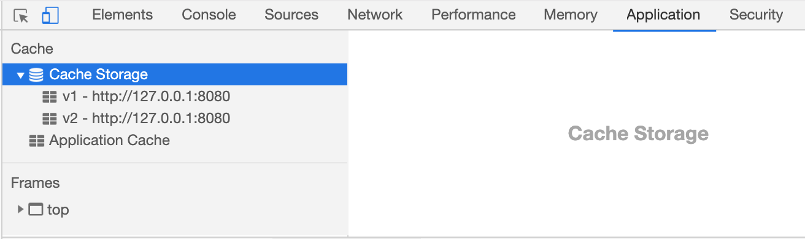

[toc]

## 1. Cache API

在上一节 Fetch API 的介绍当中提到， Fetch API 提供了 Request、Response 等偏底层的类对象， 这样就能以统一的形式将资源的请求与响应过程应用到更多的场景中。 本节所介绍的 Cache API 就属于另一种资源请求与响应的场景， Cache API 提供了一系列的方法实现了请求响应对象的缓存管理，因为它可以作为 资源请求响应的缓存仓库， 为Service Worker 实现离线缓存提供基础支持。

接下来将介绍 Cache API 的使用方法。


## 2. 兼容性检测

我们可以在主线程或者 Worker 线程中通过判断  全局变量 `caches` 是否存在来检测浏览器是否支持  Cache API:

```javascript
if ('caches' in self){
    console.log('当前环境支持 Cache API')
}
```

## 3. 打开 Cache 对象

通过 `cache.open()` 方法可以打开一个 Cache 对象，其语法为：
```javascript
caches.open(cacheName).then(cache=> {/* 获得 Cache 对象 */})
```

其中参数 cacheName 表示要打开的 Cache 对象的名称。 该方法是异步方法，返回的 Promise 对象在 resolve 时会返回成功打开的 Cache 对象。 打开 Chrome 开发者工具， 切换到 Application - Cache Storage 选项卡可以观察到， 在执行 `caches.open()` 方法时， 会在  Cache Storage 下面建立同名仓库，每个仓库里面的内容就是操作对象的 Cache 对象后写入的资源缓存。 



## 4. 添加缓存

Cache 对象提供了 `put()`、`add()`、`addAll()` 三个方法来添加或者覆盖资源请求响应的缓存。需要注意的是， **这些添加缓存的方法只会对 GET 请求起作用**

### 4.1 `Cache.put(request,response)`

资源请求响应在通过 Cache API 进行存储的时候，会以请求的 Request 对象作为键， 响应的 Response 对象作为值， 因此 `put()` 方法需要依次传入资源的请求和响应对象，然后生成键值对，并缓存起来。 下面举例说明它的使用方法：
```javascript
// 假设 cache 由caches.open('v1') 打开
cache.put(new Request('/data.json'),new Response(JSON.stringify({name:'lilei'})))
```

https://lavas-project.github.io/pwa-book/chapter03/4-cache-api.html