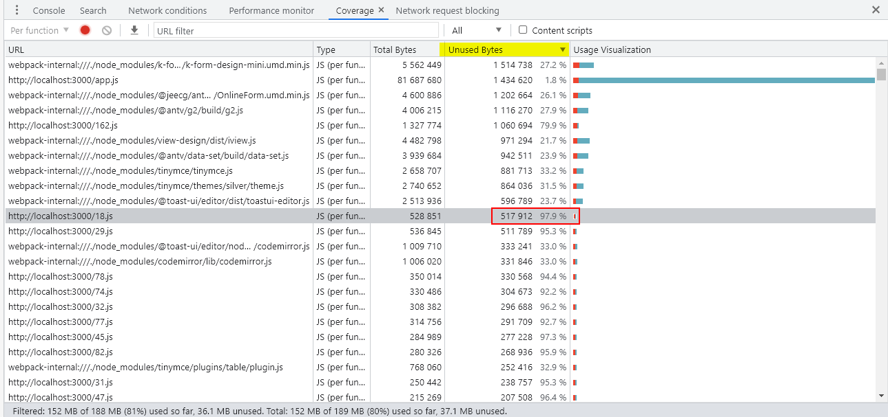
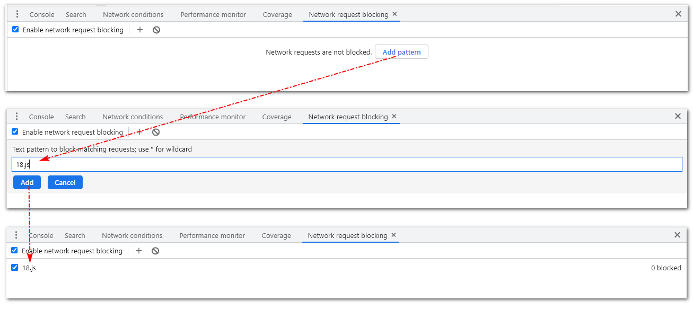
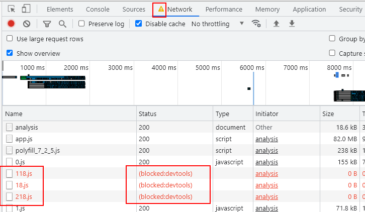

1. <kbd>Ctrl</kbd> + <kbd>Shift</kbd> + <kbd>p</kbd>  =>    :`Show Coverage` => <kbd>reload</kbd>

   可以看到js文件的代码利用率。

2. 临时阻止js的加载，使用

   <kbd>Ctrl</kbd> + <kbd>Shift</kbd> + <kbd>p</kbd>  =>    :`Show Network requests are not blocked` => <kbd>Add pattern</kbd>

   输入文件路径，例如：

   

   这个js文件的利用率在 Coverage 中看到， `http://localhost:3000/18.js` 这个文件的未利用率高达97.7% 。 

   

    假如我想尝试直接阻塞它的加载，这是就可以在 “Network request blocking” 中添加一个匹配模式去匹配到这个文件。

   

   此时页面重载，就可以在network中看到，匹配到的文件都被阻塞了：

   

## collapsible markdown?

CLICK ME

**
标签与正文间一定要空一行！！！**

