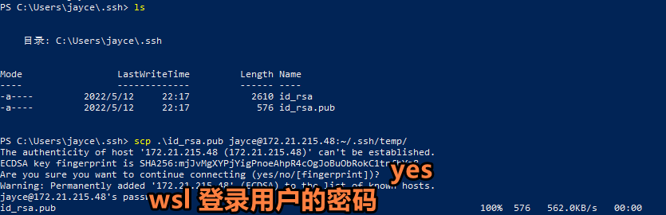

## 1. Windows ，Wsl 相互 ssh 连接（密码登录）

### 1.1 双端开启Open-SSh服务

1. Windows 开启Open-SSH

   [相关文档](https://docs.microsoft.com/en-us/windows-server/administration/openssh/openssh_install_firstuse), 执行到 "#Start and configure OpenSSH Server" 就可以了

2. Wsl 开启Open-SSH

   Wsl 自带Open-SSH, 启动方式如下：

   ```bash
   $ sudo service ssh start
   ```

   > 如果遇到以下报错：
   >
   > ```bash
   > sshd: no hostkeys available -- exiting.
   > ```
   >
   > 执行:
   >
   > ```bash
   > $ ssh-keygen -A
   > $ sudo service ssh start
   > # $ sudo service ssh restart 重启
   > ```

### 1.2 测试连接

密码连接非常简单，只要双端开启了 Open-SSH 服务， 就可以连接了：

**测试 Windows  to Wsl**

```bash
# windows powshell   
$ ssh jayce@172.21.215.48
# jayce 是我wsl用户
# 172.21.215.48 是我wsl 局域网地址

# 然后输入密码就可以了(wsl 用户密码，这里就是jayce 的用户密码)
```

**测试 Wsl to Windows**

```bash
# wsl bash
ssh jayce@192.168.0.101
# jayce 也是我windows用户
# 192.168.0.101 是我 windows 局域网地址
```

> :notebook: Tips
>
> 查看ip地址：
>
> - windows 
>
>   ```bash
>   ipconfig
>   ```
>
> - wsl
>
>   ```bash
>   hostname -I
>   ```


## 2. 免密登录

### 2.1 双端生成密钥对

```bash
# wsl bash
$ sudo ssh-keygen

# windows powershell 管理员
ssh-keygen


# 然后一路回车就好
```

生成的密钥对位于："~/.ssh/ "目录下，命令行可以通过下面命令访问：

```bash
$ cd ~/.ssh/ 
```

> :notebook:
>
> Tips:
>
> 配置文件路径：
>
> - windows："C:\ProgramData\ssh\sshd_config"
>
>   > 文件管理器地址栏 "%programdata/ssh%" 回车即可访问，注意该目录须在首次启动sshd服务后才会产生，且属于隐藏目录。 powershell 可能看不到，但是直接可以 `cd ProgramData` 进去。
>
> - Wsl :  "/etc/ssh/sshd_config"

### 2.2 向对端添加 本端 的公钥

#### 2.2.1 Windows 到 Wsl

1. 创建 wsl 临时目录：

   ```bash
   # wsl
   $ mkdir ~/.ssh/temp
   ```

2. 通过 scp 将 windows 公钥发送到 第一步在 wsl 创建的目录，即 wsl 下 "~/.ssh/temp"

   ```shell
   # powershell
   $ cd ~/.ssh/
   $ scp ./id_rsa.pub jayce@172.21.215.48:~/.ssh/temp/
   # jayce 为我自己wsl 用户名，172.21.215.48 是我自己的wsl 局域网ip
   ```

   

3. 将 ~/.ssh/temp/id_rsa.pub 追加到 ~/.ssh/authorized_keys 文件

   ```bash
   # wsl
   $ cd ~/.ssh/
   $ touch authorized_keys #如果目录下有这个文件就不用创建
   $ cat ~/.ssh/temp/id_rsa.pub >> ~/.ssh/authorized_keys
   ```

4. 重启 wsl sshd 服务

   ```bash
   # wsl
   $ sudo service ssh restart
   ```

5. windows 测试连接 wsl

   ```shell
   # windows powershell
   ssh jayce@172.21.215.48 #回车即可连接上
   ```

#### 2.2.2  Wsl 到 Windows 

1. ~~通过 `ssh-copy-id` 命令将 wsl 本端 公钥发送至 windows~~

   ```bash
   # wsl bash
   $ cd ~/.ssh/
   $ ssh-copy-id -i ./id_rsa.pub jayce@192.168.0.101
   ```

   > 不知道为啥该命令会丢失公钥字符，所以还是用scp传到windows

2. 创建 windows 临时目录

   ```shell
   # windows shell
   mkdir ~/.ssh/temp
   ```

3. 通过 scp 将 wsl 公钥发送到 第2步在 windows 创建的临时目录，即 windows下 "~/.ssh/temp/"

   ```bash
   # wsl bash
   $ cd ~/.ssh/
   $ scp ./id_rsa.pub jayce@192.168.0.101:C:/Users/jayce/.ssh/temp/
   # 注意路径
   # jayce 为我自己的windows 用户名
   # 192.168.0.101 为我自己的windows 局域网ip 地址
   ```

4. 在windows "~/.ssh/" 目录下创建 "authotized_keys" 的无扩展名文件

   ```shell
   # windows shell
   
   cat authotized_keys;
   # 1. 如果有这个文件了，就不用创建了，否则创建该文件 `touch authotized_keys`
   # 2. 确保输出正确，或者为空。 如果不正确，删除其文件内容，`echo "" > authotized_keys`
   ```

5. 将 第3步 传到 "~/.ssh/temp/" 下的 wsl 公钥文件 —— id_rsa.pub 文件的内容追加到 authotized_keys 文件。

   ```shell
   # windows shell
   cat ~/.ssh
   cat ./temp/id_rsa.pub >> authotized_keys
   ```

6. 重启 windows sshd 服务

   ```shell
   # windwos shell
   Restart-Service -Name sshd -Force
   ```

   


> - `cd .ssh`
>
> - `touch config`
>
> - `gedit config`
>
> - 在config 中添加如下内容
>
>   ```ABAP
>     Host  000
>     HostName 192.168.18.36 
>     User  dc
>     Port  22
>   ```