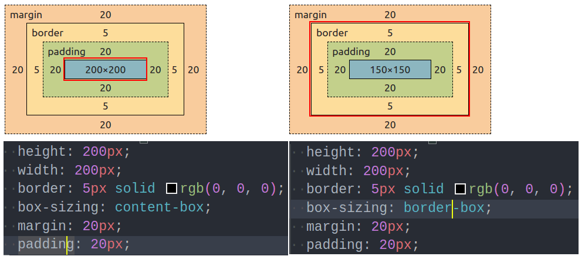
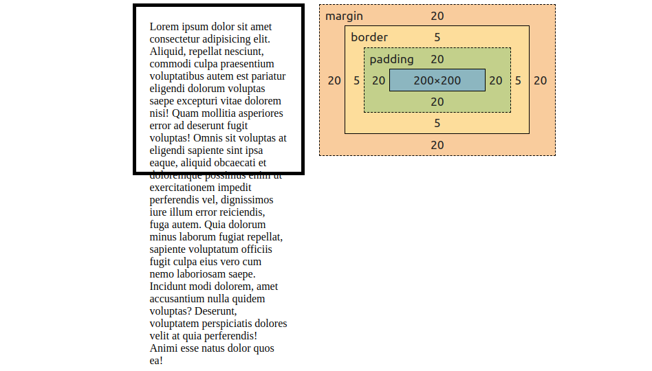

https://javascript.info/size-and-scroll

### 问题基础1: 盒模型 - box-sizing 属性



对于一个给定的 `div` 元素， 其被指定的 `box-sizing` 属性，主要影响了 `width` 和 `height` 属性的表现。

当 `box-sizing` 为 `content-box` 时，宽和高将会指定为其内容区域的大小。 内容区域以外的 `padding`, `border` 都将在给定宽高的基础上，向外延展。

而当 `box-sizing` 为 `border-box` 时，宽高将会指定包含`border` 整个模型的大小。 那么这是实际的 content 的宽度，将会根据实际的 `padding` 和 `border` 宽度进行自动收缩。 也就是 内容区域的宽度 = `width` - `border`宽度 - `padding` 宽度。 


> 以下讨论，以 height 示例，width 等同。

### `clientHeight`

`clientHeight` 的计算公式为：

 $clientHeight = 内容区域高度 + vertical_-padding - horizontal_-scrollbar_-width(如果存在)$


不存在滚动条，给定一个这样的元素：

```css
.box {
  height: 200px;
  width: 200px;
  border: 5px solid rgb(0, 0, 0);
  margin: 20px;
  padding: 20px;
}
```



clientHeight: 200px(内容区域高度) + 40px(垂直向padding) = 240px


clientHeight:

有无滚动条：

没有 padding-vertical + height
