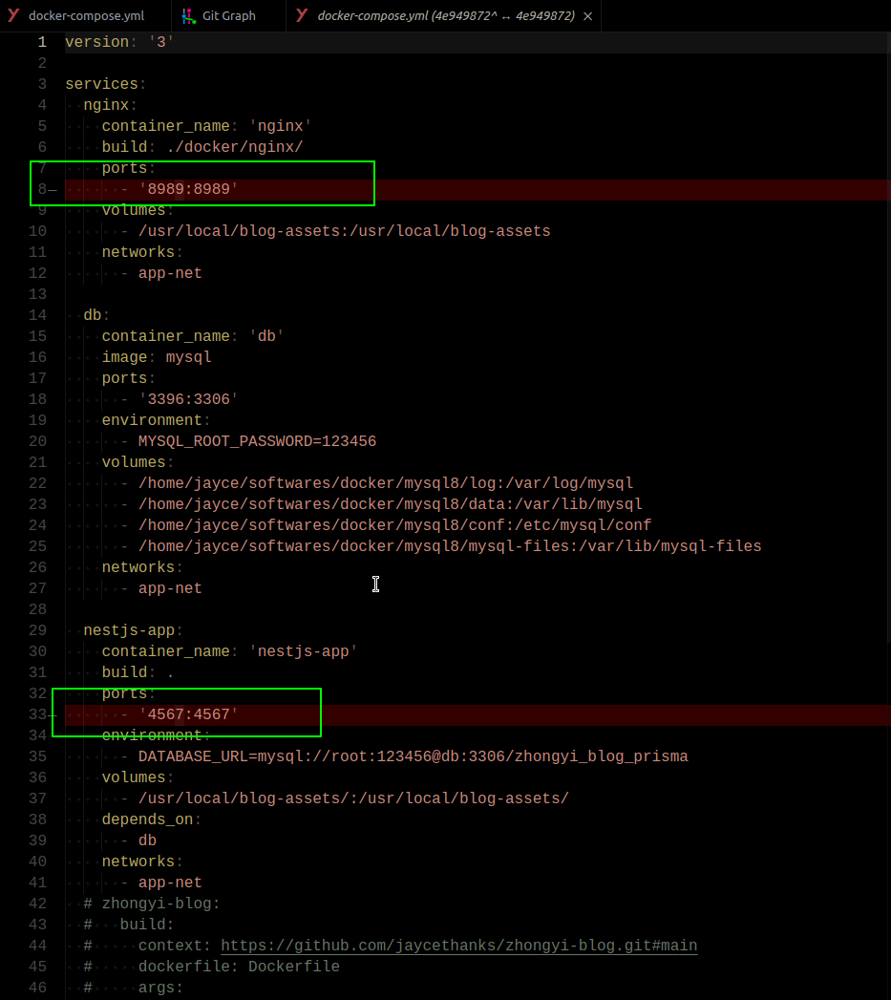
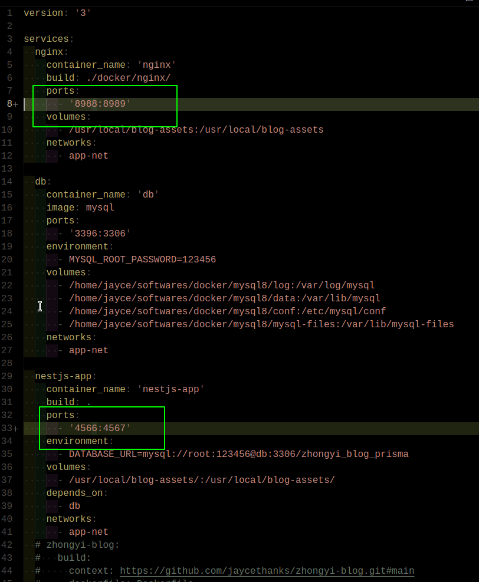
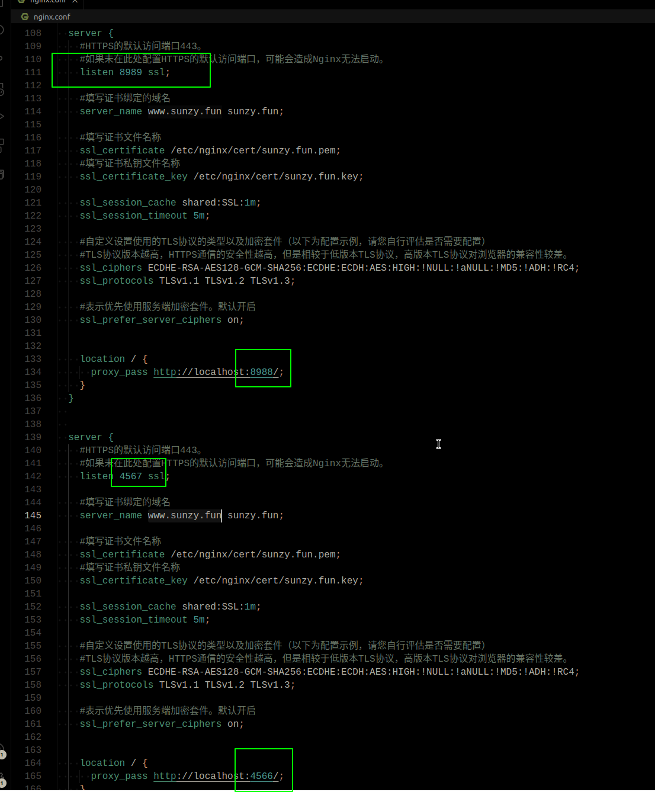
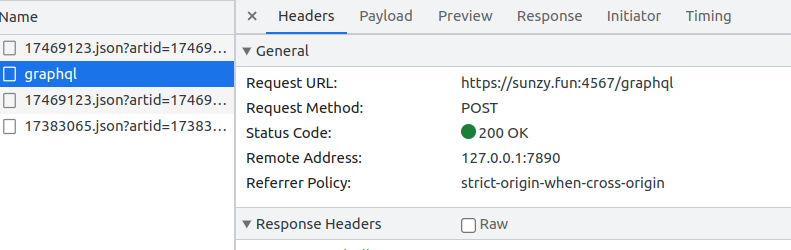
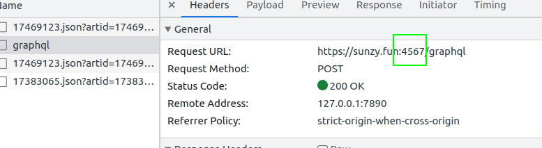
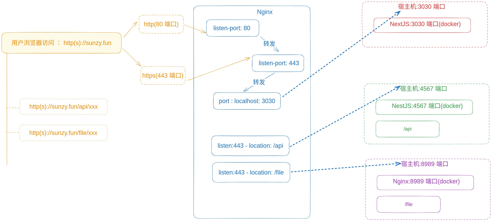

后端nestjs 部署在 docker 的4567 端口，并映射到宿主机的 4567 端口， 后端的 nginx 文件serve 部署在 docker 的 8989 端口， 并映射在宿主机的 8989 端口。 



> 后台 docker-compose.yml 文件


前台 nextjs ， 因为 build 的时候会将 请求 url 写死， 所以在build 的时候将 url 通过变量传入的：

```bash
# nextjs package.json.scripts:

 "docker:build": "docker stop zhongyi-blog; docker rm zhongyi-blog; docker rmi zhongyi-blog-img; docker build --build-arg NEXT_PUBLIC_USERID=f3e63961-5b62-4a77-9bb8-d7f3252fb694 --build-arg NEXT_PUBLIC_NGINX_SERVER=https://sunzy.fun:8989 --build-arg NEXT_PUBLIC_GRAPHQL_API_URL=https://sunzy.fun:4567/graphql -t zhongyi-blog-img --network zhongyi-blog-server_app-net .",
    "docker:run": "docker run -d -p 3030:3030 -e NEXT_PUBLIC_USERID=f3e63961-5b62-4a77-9bb8-d7f3252fb694 -e NEXT_PUBLIC_NGINX_SERVER=https://sunzy.fun:8989 -e NEXT_PUBLIC_GRAPHQL_API_URL=https://sunzy.fun:4567/graphql --name zhongyi-blog --network zhongyi-blog-server_app-net --restart=always zhongyi-blog-img",
```


本来 http 是是没有问题的, 但是现在 因为网站部署了 https, 但是由于 浏览器的安全策略限制，是不允许https 站点中有 http 请求的。会报错 "blocked:mixed"

于是就有这么么个解决办法， nginx 配置反向代理， 分别监听来自 8989 和 4567 端口的请求，然后转发到docker 对应的端口， 由于之前的docker 服务占用了 8989 和 4567 端口， 所以直接只该 nginx 配置是不行的， 会报端口已经占用。 为了解决这个问题， 我是这么做的， 将docker 中的8989 和 4567 映射到宿主机的 8989 和 4567 改一下， 例如 8988 和4566, 然后 nginx 转发到这两个 端口， 如下:

首先修改  后台服务



nginx 配置：



> 将前台来自 sunzy.fun:8989 和 sunzy.fun:4567 的https 请求分别转发到 8988 和 4566

然后前台的 nextjs 也需要对应的进行修改：

```bash
# # nextjs package.json.scripts:
 "docker:build": "docker stop zhongyi-blog; docker rm zhongyi-blog; docker rmi zhongyi-blog-img; docker build --build-arg NEXT_PUBLIC_USERID=f3e63961-5b62-4a77-9bb8-d7f3252fb694 --build-arg NEXT_PUBLIC_NGINX_SERVER=https://sunzy.fun:8989 --build-arg NEXT_PUBLIC_GRAPHQL_API_URL=https://sunzy.fun:4567/graphql -t zhongyi-blog-img --network zhongyi-blog-server_app-net .",
    "docker:run": "docker run -d -p 3030:3030 -e NEXT_PUBLIC_USERID=f3e63961-5b62-4a77-9bb8-d7f3252fb694 -e NEXT_PUBLIC_NGINX_SERVER=https://sunzy.fun:8989 -e NEXT_PUBLIC_GRAPHQL_API_URL=https://sunzy.fun:4567/graphql --name zhongyi-blog --network zhongyi-blog-server_app-net --restart=always zhongyi-blog-img",
```

> 将请求地址修改为  https://sunzy.fun:8989 和 https://sunzy.fun:4567/





Okay , 现在这样就 OK 了。 


但是， 有没有感觉这个过程也太麻烦了？？

谁的站点是这么写的啊？ 请求还要指定端口的 ？



而且nginx 的配置， 针对每个端口去做转发， 这也太呆瓜了，我突然意识到我需要推翻重来， nginx 配置应该是这样的才对吧：

```conf
server {
  listen 443;
  server_name yourdomain.com;

  ssl on;
  # 其他 SSL 配置项...

  location /api {
    proxy_pass http://backend:4567;
  }

  location /other {
    proxy_pass http://backend:8989;
  }

  # 其他前端路由配置...
}
```

确实如此啊， 我不需要在 nextjs build 的时候， 把我的 公网 ip 写死的啊， 过程应该是这样的才对：



这样一来有几个问题就被解决了：

- Next 在开发阶段同过本地的环境变量配置后端接口和文件服务器地址的路由就可以： `/api`,`/file`, 然后在 next.config.js 中去配置rewrite 代理规则转发到本地开发服务器， 
- Next 在上线服务器时， 通过 Dockerfile 构建镜像时，不需要再注入环境变量为公网服务器地址了。 客户端在请求接口时，会直接请求 sunzy.fun/api, sunzy.fun/file, 然后我们在 nginx 中做了反向代理配置，去承载转发到 docker 后台服务.
- 配置大量简化

以下来做一下尝试：

首先， 修改 Nextjs 本地环境变量， 测试开发阶段是否正常：

Nextjs 前端请求是 GraphQL, 在连接器中， 我们之前是这么做的:

```tsx
// pages/_app.tsx
const client = new ApolloClient({
  link: new HttpLink({
    uri: process.env.NEXT_PUBLIC_GRAPHQL_API_URL,
    headers: {
      'uid': process.env.NEXT_PUBLIC_USERID || '',
      'X-App-Version': '1.0.0',
    },
  }),
  cache: new InMemoryCache(),
});
```

```
// /.env 环境变量
NEXT_PUBLIC_USERID="f3e63961-5b62-4a77-9bb8-d7f3252fb694"
NEXT_PUBLIC_GRAPHQL_API_URL="http://localhost:4567/graphql"
NEXT_PUBLIC_NGINX_SERVER="http://localhost:8989"
```

```js
// next.config.js 
/** @type {import('next').NextConfig} */
const nextConfig = {
  reactStrictMode: true,
  swcMinify: true,
  images: {
    remotePatterns: [
      {
        protocol: 'https',
        hostname: '**',
      },
      {
        protocol: 'http',
        hostname: '**',
      },
    ],
    // domains: ['placeimg.com', 'raw.githubusercontent.com', '**.cnblogs.com', 'img2023.cnblogs.com', 'img2022.cnblogs.com', 'img2021.cnblogs.com'],
  },
  async rewrites() {
    return [
      {
        source: '/file/:path*',
        destination: `${process.env.NEXT_PUBLIC_NGINX_SERVER}/:path*`, // Proxy to Backend
      },
    ];
  },
};

module.exports = nextConfig;
```

我们之前配置了 `/file/` 的rewrite 规则， 现在我们统一一下：

修改 `pages/_app.tsx` 中的连接器：

```diff
const client = new ApolloClient({
  link: new HttpLink({
-    uri: process.env.NEXT_PUBLIC_GRAPHQL_API_URL,
+    uri: '/api',
    headers: {
      'uid': process.env.NEXT_PUBLIC_USERID || '',
      'X-App-Version': '1.0.0',
    },
  }),
  cache: new InMemoryCache(),
});
```

修改 next.config.js, 新增 `/api` 的rewrite配置, 并保持 `.env` 不变：

```diff
// next.config.js 
....
  async rewrites() {
    return [
      {
        source: '/file/:path*',
        destination: `${process.env.NEXT_PUBLIC_NGINX_SERVER}/:path*`, // Proxy to Backend
      },
+     {
+       source: '/api/:path*',
+       destination: `${process.env.NEXT_PUBLIC_GRAPHQL_API_URL}/:path*`, // Proxy to Backend
+     },
    ];
  },
};
....
```


** 后来发现好像不行 **

因为 Nextjs 在打包阶段，需要 SSG 也需要和 后端服务器通讯，  但是又感觉应该是可以的。  这地方现在有点乱， 我需要好好思考思考。

