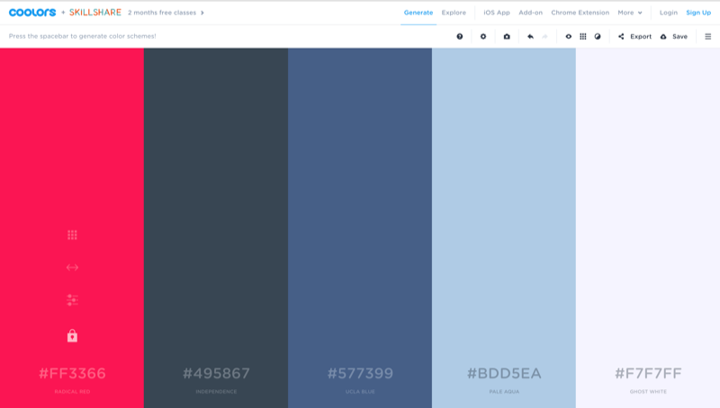

[toc]

> 原文地址：
>
> [A quick guide to choosing a color palette](https://www.invisionapp.com/inside-design/quick-guide-color-palette/)
>
> [Color Theory 101: A Complete Guide to Color Wheels & Color Schemes](https://blog.hubspot.com/marketing/color-theory-design#color-theory-101)

## 色彩理论基础

色彩专业名词：

- **Hue**: what color something is, like blue or red
- **Chroma**: how pure a color is; the lack of white, black or gray added to it
- **Saturation**: the strength or weakness of a color
- **Value**: how light or dark a color is
- **Tone**: created by adding gray to a pure hue
- **Shade**: created by adding black to a pure hue
- **Tint**: created by adding white to a hue

## Four main types od color palettes#四大主要的色调类型(调色板)

1. **Monochromatic**#单一色

   Different shades and depths of a single hue#单一个色调的不同阴影和深度,

   这种是最简单的色系，如果设计不当，单一色策略可能会显得很无聊，空洞。

   

   单一色，通常用于去产生一种持续、连贯的视觉感受。 尽管它缺少颜色对比， 但是，显得很整洁。

   单一色通常用于不需要强调高对比的图表。

   

   

   

2. **Analogous**#相邻色

   一个主色调，和色轮上相邻的颜色组合。 这种调色板通常在设计中用于表达一致和统一性效果显著。由于色调反差不大，这种调色板策略也易于操作，不会显得很不协调。

   

   相邻色结构，并不会创建高对比的颜色， 因此他们通常用于创建 柔和，少对比的设计。例如， 你可以用相邻色结构去创建一个基于秋天，或者春天的色系。	

   

   这种色彩结构很适合创建暖色系主题 如 橙黄色， 或者冷色系主题，如紫蓝绿。 如下示例：

   

3. **Complementary**#互补色

   指的是色轮的互补或相反的颜色（例如红色和绿色，蓝色和橙色等）。

   互补的调色板非常适合传达平衡感. 此外，和相邻色一样， 可以通过添加不同的tints#色彩，和shades#阴影，来拓展这些schemes#(色系/策略)，这样尤其有助于避免造成眼睛疲劳的强烈对比。

   

   互补色由于其不和谐的表现，应当慎用。 在常规的使用中， 通常是有一个主色，其互补色则作为强调色使用。

   互补色也常被用于强调性强的图表中。 

   

   

   

   

4. **Triadic**#三元色

   色轮上三个等距点上的取色（例如，红黄蓝），三元色用于创建多样的色盘，但是需要很多的实验，因为将大量的对比色放在一起容易造成不和谐。

   
   
   
   
   

## What colors mean#色彩的心理情绪暗示

- **Red**: energy, power, passion 
- **Orange**: joy, enthusiasm#激情, creativity
- **Yellow**: happiness, intellect, energy
- **Green**: ambition, growth, freshness#生机, safety
- **Blue**: tranquility#安宁, confidence, intelligence
- **Purple**: luxury, ambition, creativity
- **Black**: power, elegance#典雅, mystery
- **White**: cleanliness, purity, perfection

> 更多参看这里https://www.canva.com/learn/color-meanings-symbolism/

## A note about accessibility#可访问性

UX 设计师需要关注的一个挑战点，是色盲或者CVD#色觉缺乏症对网站的访问需求。Pinterest 工程师团队在这方面有可借鉴之处, 参见 [link](https://medium.com/@Pinterest_Engineering/seven-best-practices-for-inclusive-product-design-9476c61f1e17).

## 3 tips to get you started#入门

- **Start with greyscale** 通过先用灰度来设计，可以使得你确保专注于可用性和清晰的导航， 而不是去纠结颜色布置， 强迫你自己专注于布局元素和优化留白，干净整洁的层次结构是一个优秀 UX 的基础。 
- **Use the 60-30-10 rule** 你的色彩引用比例应该是 60% + 30% + 10%。 这个古老的室内设计规则是为了平衡你的颜色。这个公式之所以有效，是因为它能让眼睛舒服地从一个焦点移动到另一个焦点。它的使用也非常简单:60%是主色调，30%是次要颜色，10%是强调色。即使你的调色板有超过三种颜色(但请不要超过五种)，保持颜色的平衡会让你的眼睛更干净，也会让你的用户的大脑更舒适。
- **The best color combinations come from nature** 它们看起来总是很自然。关于寻找设计解决方案的环境，最好的事情是调色板总是在变化。日出，日落，海滩，这些都有独特的调色板，可以适应您的需求。使用像Adobe Capture这样的应用程序(下一节将详细介绍)将调色板从照片中分离出来，以便在其他应用程序中使用。

## 3 color tools that'll up you palette game

- [**Color Hunt**](https://colorhunt.co/) 一个免费的开放平台，可为彩色灵感提供数千种时尚的手工挑选调色板。

  

  

- **[Coolors.co](http://coolors.co/)** 该工具是“适用于凉爽设计师的超级快速配色方案”。有一个iOS应用以及用于Photoshop和Illustrator的Adobe附加组件。您可以从社区浏览数千个调色板，几乎可以从任何地方保存和访问您喜欢的调色板，并仅需单击几下即可在项目中使用它们。

  

- **[Paletton](http://paletton.com/)** 这类似于Coolors和Color CC，主要的区别是你不限于5个色调。当你有三原色并且想要探索其他色调时，这是一个很好的工具。如果你想探索我们上面提到的所有不同类型的调色板，这是一个学习它们的好工具。

  